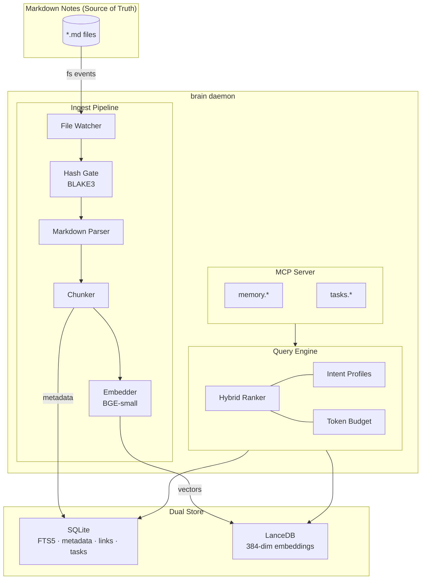
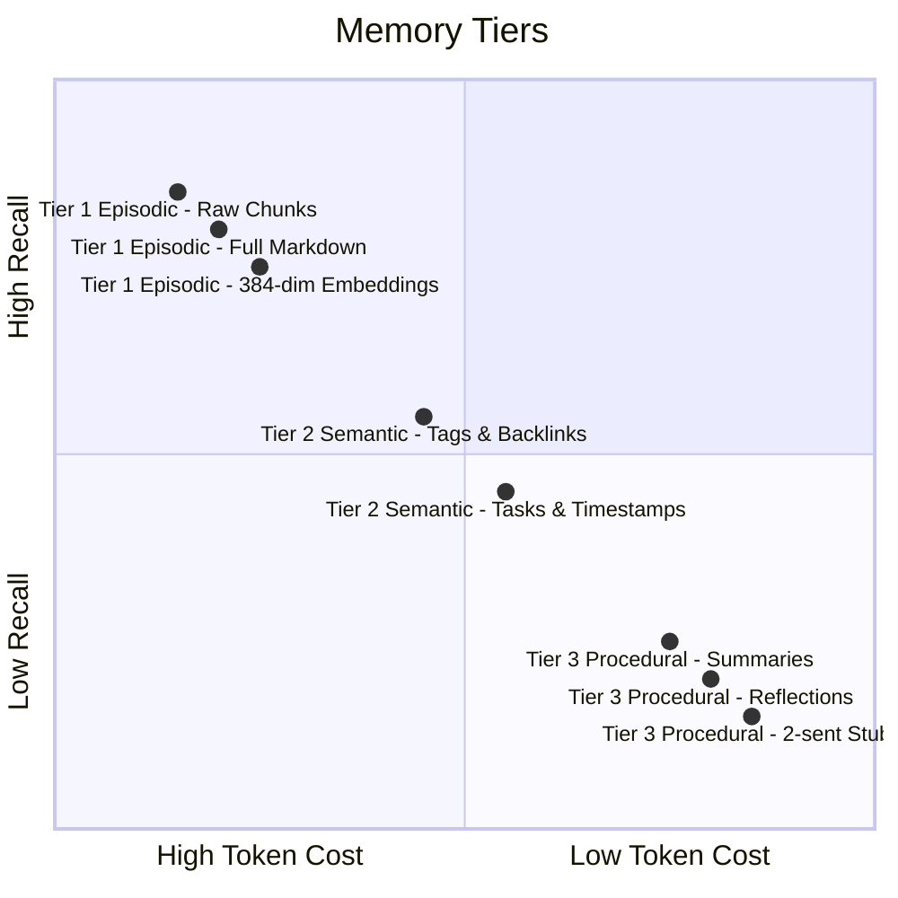

# brain

A local-first personal knowledge base daemon that indexes Markdown notes into a hybrid retrieval system and exposes token-budgeted memory tools to AI agents over MCP.

---

## Status

| Phase                 | Goal                                                          | Status      |
| --------------------- | ------------------------------------------------------------- | ----------- |
| 0 — POC               | Scaffolding, embedding model, vector store, CLI               | Done        |
| 1 — MVP               | Incremental indexing, content hashing, file identity          | Done        |
| 2 — Feature Complete  | Hybrid retrieval, MCP server, structured parsing, task system | Done        |
| 3 — Hardening         | Batching, concurrency, observability, index optimization      | In Progress |
| 4 — Release Candidate | Migrations, packaging, daemon lifecycle, test suite           | Planned     |

---

## Why brain?

Long-running AI agents face a hard constraint: context windows are finite, and filling them with irrelevant content wastes both money and reasoning quality. Research on agentic memory systems — [MemGPT](https://arxiv.org/abs/2310.08560), [Generative Agents](https://arxiv.org/abs/2304.03442), [Mem0](https://github.com/mem0ai/mem0) — has converged on the same insight: agents need explicit mechanisms to control _what_ they read and _how much_ they read, not just better retrieval.

Existing tools don't solve this well:

- **Knowledge graph tools** (Obsidian plugins, etc.) are built for human navigation with no concept of token budgets or machine-readable retrieval APIs.
- **RAG-as-a-service** (Pinecone, Weaviate cloud) requires network calls, incurs per-query costs, and sends your notes to third parties — with only simple top-k vector search.
- **Local vector databases** (sqlite-vec, Chroma) provide semantic similarity but miss keyword search, recency, link structure, and tag matching. A query for "meeting notes from last Tuesday" fails entirely on pure vector search.

brain takes a different position: run everything locally, combine all retrieval signals into a hybrid score, enforce token budgets at the API level, and treat Markdown files as the durable source of truth.

---

## Overview

brain is a Rust daemon that watches a directory of Markdown files, incrementally indexes them into a dual-store system (SQLite for full-text search and metadata, LanceDB for 384-dim vector embeddings), and serves retrieval tools over MCP stdio JSON-RPC.

**Token budgeting is a first-class constraint.** Instead of returning "top-k chunks" regardless of size, `memory.search_minimal` returns compact stubs within a declared token budget. The agent inspects the stubs, then calls `memory.expand` to fetch full content only for the chunks worth reading. This two-phase progressive retrieval lets agents spend context window space on reasoning rather than raw text.

**Hybrid scoring combines six signals** — vector similarity, BM25 keyword ranking, recency decay, backlink count, tag match, and importance — into a single relevance score. An `intent` parameter shifts signal weights per query type: `lookup` upweights keyword precision; `planning` upweights recency and link structure; `synthesis` upweights semantic similarity.

**Everything runs on-device.** No network calls, no API keys, no ongoing cost after the initial ~130MB model download. The entire index can be rebuilt from the Markdown files at any time.

---

## Quick Start

### Prerequisites

- Rust toolchain (stable, edition 2024)
- [just](https://github.com/casey/just) task runner

### Setup

```sh
git clone <repo-url>
cd brain-02
just setup-model
brain init ~/notes
brain daemon start
```

`just setup-model` downloads BGE-small-en-v1.5 weights (~130MB). `brain init` creates the brain configuration and performs the initial index. `brain daemon start` launches the daemon and registers it to auto-start on login (launchd on macOS, systemd on Linux).

### Model Cache

brain uses [BGE-small-en-v1.5](https://huggingface.co/BAAI/bge-small-en-v1.5) for embeddings. The model is downloaded once and verified via BLAKE3 checksums at every startup.

```
~/.brain/models/bge-small-en-v1.5/
  config.json          BERT config (hidden_size=384)
  tokenizer.json       WordPiece tokenizer
  model.safetensors    Model weights (~130MB, memory-mapped)
```

**Download the model** (choose one):

```sh
# Option 1: Run the setup script directly (requires curl + installs HuggingFace CLI if needed)
curl -sSL https://raw.githubusercontent.com/benediktms/brain/master/scripts/setup-model.sh | bash

# Option 2: If you have the HuggingFace CLI already installed
hf download BAAI/bge-small-en-v1.5 config.json tokenizer.json model.safetensors \
  --local-dir ~/.brain/models/bge-small-en-v1.5
```

Override the model location with `BRAIN_MODEL_DIR` or `BRAIN_HOME`. If a file is corrupted or swapped, brain will report a checksum mismatch with expected and actual hashes — re-download the model to fix.

### Connect to an AI agent

```json
{
  "mcpServers": {
    "brain": {
      "command": "brain",
      "args": ["daemon"]
    }
  }
}
```

---

## MCP Tools

| Tool                    | Description                                                                                   |
| ----------------------- | --------------------------------------------------------------------------------------------- |
| `memory.search_minimal` | Search notes and return lightweight stubs within a token budget. Use first to orient.         |
| `memory.expand`         | Fetch full chunk content for specific IDs from `search_minimal`. Truncates at budget.         |
| `memory.write_episode`  | Record an episodic memory (goal, actions, outcome) with tags and importance.                  |
| `memory.reflect`        | Two-phase: returns source material for synthesis, then stores the agent-generated reflection. |
| `tasks.apply_event`     | Apply a task event (create, update, status change, dependency, label, comment) via event sourcing. |
| `tasks.get`             | Get a single task by ID with full details, relationships, comments, labels, and linked notes. |
| `tasks.list`            | List tasks filtered by status (`all`, `ready`, `blocked`) or fetch specific tasks by ID.      |
| `tasks.next`            | Return highest-priority ready tasks, sorted by priority or due date.                          |
| `status`                | Get runtime health metrics: latency percentiles, token usage, queue depth, stuck files.       |

### Progressive Retrieval Pattern

1. `memory.search_minimal` with generous `k` and narrow budget (~600 tokens) — orient cheaply.
2. `memory.expand` on the 2–4 most relevant stubs with a larger budget (~2000 tokens) — read in detail.
3. Optionally expand more chunks from step 1 if context permits.

Cost: ~600–800 tokens for orientation + ~500–2000 per deep read, vs. 4,000–8,000 tokens for naive top-k.

---

## Architecture



### Memory Tiers



For full technical details — sequence diagrams, hybrid scoring formula, intent weight profiles, performance targets, storage role separation, and mathematical foundations — see [docs/ARCHITECTURE.md](docs/ARCHITECTURE.md).

---

## Usage

```sh
brain index                              # One-shot index all notes
brain watch                              # Watch and index incrementally
brain query "weekly review template"     # Search from CLI
brain query --intent planning "next steps"
brain query --budget 800 "async patterns"
brain daemon start                       # Start + register auto-start
brain daemon stop                        # Stop + deregister
brain daemon status                      # Check daemon state
```

### Multiple Brains

Brains are named containers with independent notes, indexes, and config. Managed via a central registry at `~/.brain/`:

```toml
# ~/.brain/config.toml
[brains.personal]
root = "~/notes"
notes = ["~/notes"]

[brains.work]
root = "~/code/my-project"
notes = ["~/code/my-project/docs", "~/code/my-project/notes"]
```

All derived data lives in `~/.brain/brains/<name>/`, not in the project directory.

---

## Development

```sh
just build        # Build
just check        # Type check
just test         # Run tests
just lint         # Lint
just fmt           # Format
just clean        # Clean build artifacts
just clean-db     # Clean database (forces full reindex)
```

### Workspace Layout

```
brain/
  brain_lib/      # Core library: indexing, retrieval, embedding, MCP, tasks
  cli/            # Thin binary: wires CLI commands to library functions
  docs/
    ARCHITECTURE.md
    RESEARCH.md
  justfile
```

### Release

```sh
just tag patch    # 0.1.0 -> 0.1.1
just tag minor    # 0.1.0 -> 0.2.0
just tag major    # 0.1.0 -> 1.0.0
just changelog
```

---

## Further Reading

- [docs/ARCHITECTURE.md](docs/ARCHITECTURE.md) — Full technical architecture, sequence diagrams, storage design, mathematical foundations
- [docs/OPERATIONS.md](docs/OPERATIONS.md) — Upgrading, backup, recovery, troubleshooting, performance tuning, model management
- [docs/RESEARCH.md](docs/RESEARCH.md) — Research survey of agentic memory systems, retrieval design, token budget design
- [MemGPT](https://arxiv.org/abs/2310.08560) — Virtual context management for long-running agents (Packer et al., 2023)
- [Generative Agents](https://arxiv.org/abs/2304.03442) — Recency/relevance/importance scoring with reflective synthesis (Park et al., 2023)
- [Mem0](https://github.com/mem0ai/mem0) — Memory extraction, consolidation, and tiered retrieval
- [MCP Specification](https://modelcontextprotocol.io/) — AI agent tool integration over stdio JSON-RPC

---

## License

MIT
