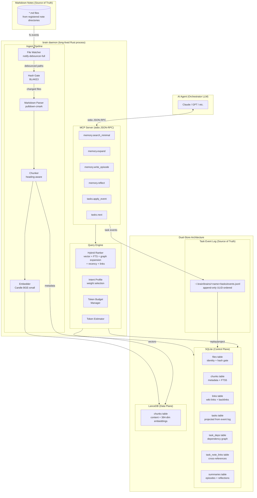

# brain

A local-first personal knowledge base daemon that indexes Markdown notes into a hybrid retrieval system and exposes token-budgeted memory tools to AI agents over MCP.

---

## Overview

brain is a Rust daemon that turns a directory of Markdown files into a queryable knowledge base for AI agents. It watches your notes for changes, incrementally indexes them into a dual-store system (SQLite for full-text search and structured metadata, LanceDB for 384-dimensional vector embeddings), and exposes retrieval and memory tools over MCP stdio JSON-RPC.

The central design insight is that **token budgeting is a first-class constraint**, not an afterthought. Most retrieval systems return "top-k chunks" without regard for how many tokens those chunks consume. brain treats context window space as a scarce resource: the `memory.search_minimal` tool returns compact stubs that orient an agent cheaply, while `memory.expand` fetches full content only for the specific chunks the agent decides are worth reading. This two-phase progressive retrieval pattern lets agents use far more of their context window for reasoning rather than raw document text.

Hybrid scoring combines six signals — vector similarity, BM25 keyword ranking, recency decay, backlink count, tag match, and importance — into a single relevance score. The relative weight of each signal shifts based on the declared intent of the query: a `lookup` query upweights keyword precision; a `planning` query upweights recency and link structure; a `synthesis` query upweights semantic similarity and graph connectivity. All computation runs entirely on-device: no network calls, no external services, no API keys, and no ongoing cost after the initial model download.

The system maintains strict unidirectional sync. Markdown files are the source of truth for notes; SQLite metadata, LanceDB embeddings, and FTS5 indexes are derived projections that can always be rebuilt from source. For tasks, the append-only JSONL event log is the source of truth; SQLite task tables are projections rebuilt by replaying the log. This invariant makes the system resilient to partial failures and easy to reason about.

---

## Motivation

### The Context Window Scarcity Problem

Long-running AI agents face a hard constraint: context windows are finite, and the cost of filling them with irrelevant content is paid in both money and quality. Research on agentic memory systems has converged on this observation:

- **MemGPT** (Packer et al., 2023) demonstrated that virtual context management — treating main context as a fixed-size working set and managing what moves in and out — significantly improves performance on long-horizon tasks. The key insight is that agents need explicit mechanisms to control what they read, not just better retrieval.
- **Generative Agents** (Park et al., 2023) showed that combining recency, relevance, and importance signals for memory retrieval, and periodically synthesizing episodic memories into higher-level reflections, produces more coherent long-running agent behavior. Flat top-k retrieval without these signals leads to repetitive or incoherent memory use.
- **Mem0** demonstrated that explicit memory extraction, consolidation, and tiered retrieval reduces token cost and latency compared to naive full-context approaches.

brain takes these findings seriously. The retrieval API is designed around budget parameters, not result counts. Stubs are first-class objects, not a degraded form of chunks. Reflection synthesis is a built-in tool call, not a prompt engineering trick.

### Why Existing Solutions Fall Short

**Obsidian plugins and knowledge graph tools** are built for human navigation. They produce rich visual interfaces but have no concept of token budgets, agent protocols, or machine-readable retrieval APIs. Exporting a vault to feed an LLM context is a manual, all-or-nothing operation.

**RAG-as-a-service platforms** (Pinecone, Weaviate cloud, etc.) require network calls on every query, incur per-query costs that compound over long agent sessions, and send your personal notes to third-party infrastructure. They also typically expose only simple top-k vector search with no intent-driven weight adjustment, no token budget enforcement, and no two-phase progressive retrieval.

**Plain local vector databases** (sqlite-vec, Chroma, Qdrant running locally) solve the privacy and cost problems but provide only semantic similarity search. They do not integrate BM25 keyword search, recency decay, backlink structure, or tag matching. A query for "meeting notes from last Tuesday" fails entirely on pure vector search because semantic similarity does not capture temporal or structural intent.

**Cloud LLM memory APIs** are opaque, expensive, and require trust that your personal knowledge will be retained and processed securely. They cannot be inspected, replayed, or rebuilt.

brain takes a different position: run everything locally, integrate all retrieval signals into a principled hybrid score, enforce token budgets at the API level, and treat Markdown files as the durable, human-readable source of truth.

### Why Local-First Matters

Zero ongoing cost and privacy are the obvious arguments, but the deeper reason is reliability. A local daemon with a file watcher and a persistent SQLite database will index a file change in under a second, deterministically, without network timeouts or rate limits. The indexing pipeline can be interrupted at any point and will resume from a consistent state on restart. The entire system can be rebuilt from scratch using only the Markdown files.

### Why Hybrid Retrieval Beats Pure Vector Search

Vector similarity captures semantic relatedness well but fails at exact lookup (specific names, dates, identifiers), temporal intent (recent notes), and structural intent (heavily linked concepts). BM25 keyword search handles exact lookup but misses paraphrases and synonyms. Recency decay is essential for task-relevant memory. Link count reflects the structural importance of a note in the knowledge graph.

The research on retrieval-augmented generation consistently shows that hybrid methods outperform pure vector or pure keyword approaches across diverse query types. brain combines all six signals into a linear weighted sum whose coefficients shift per intent, giving each query type the retrieval behavior it needs.

---

## Key Design Decisions

- **Dual-store architecture (SQLite + LanceDB)**: SQLite is the control plane — transactional bookkeeping, FTS5 keyword search, graph edges, file identity, hash state. LanceDB is the data plane — vector similarity search with Arrow-native columns and efficient batch upserts. Neither store does both jobs well; separating them avoids the impedance mismatch of trying to force one store to handle both.

- **BLAKE3 hash gating**: Every file change is gated on a BLAKE3 content hash before triggering any indexing work. If the content is unchanged (editor saves, auto-formatting, Git checkouts of identical content), the pipeline is skipped entirely. BLAKE3 runs 3-4x faster than SHA-256, making the gate essentially free at the scale of a laptop vault.

- **Heading-aware chunking**: Chunks are split on Markdown heading boundaries, not arbitrary character or token counts. This keeps semantically coherent units together and gives each chunk a meaningful title derived from the heading hierarchy. Chunks are additionally bounded to approximately 400 tokens to keep embedding quality high. Byte offsets are tracked so `expand` can return provenance information for any chunk.

- **Intent-driven weight profiles**: The `intent` parameter on `memory.search_minimal` selects from five weight profiles (`lookup`, `planning`, `reflection`, `synthesis`, `auto`) that shift the emphasis of the hybrid scoring formula. This is a practical application of the insight from Generative Agents: recency, relevance, and importance should be weighted differently depending on what the agent is trying to do.

- **Progressive retrieval (stubs then expand)**: `memory.search_minimal` returns lightweight stubs containing title, a two-sentence summary, tags, and scores — enough for an agent to decide what is relevant — within a declared token budget. `memory.expand` fetches full chunk content only for selected IDs. This pattern directly implements the virtual context management insight from MemGPT: bring in what you need, when you need it, at predictable cost.

- **Memory tiers (episodic / semantic / procedural)**: Raw note chunks are episodic memory (high recall, high token cost). Structured metadata, tags, and link structure are semantic memory (lower cost, navigational). Agent-synthesized summaries and reflections are procedural memory (low cost, high signal density). The three tiers correspond to different stages of the progressive retrieval flow.

- **Append-only task event log**: Task mutations are recorded as ULID-ordered events in a JSONL file. The SQLite task tables are derived projections rebuilt by replaying the log. This makes the task subsystem crash-safe (partial writes do not corrupt state), auditable (the full history is preserved), and rebuildable (drop the projection, replay the log).

- **Capsule generation at ingest time**: Every chunk gets a deterministic title, two-sentence summary stub, and extracted tags computed at index time with zero ML cost — purely from the Markdown AST. This means `search_minimal` can return rich stubs with no generative model inference on the query path. ML-quality summarization is deferred to idle-time consolidation via `memory.reflect`.

- **Indexing state machine for partial failure recovery**: The indexing pipeline transitions through explicit states (`idle` -> `indexing_started` -> `sqlite_written` -> `indexed`). If the process is killed between SQLite and LanceDB writes, the state machine detects the inconsistency on restart and re-indexes the affected file. The content hash is not updated until both stores are consistent.

---

## Features

- Local-first: zero network calls, zero ongoing cost after initial model download
- Dual-store indexing: SQLite (FTS5, metadata, wiki-links, tasks) + LanceDB (384-dim BGE embeddings)
- Hybrid retrieval combining vector similarity, BM25, recency decay, backlink count, tag match, and importance
- Intent-driven weight profiles: `lookup`, `planning`, `reflection`, `synthesis`, `auto`
- Progressive token-budgeted retrieval: `search_minimal` returns stubs, `expand` fetches full content
- Memory tiers: Episodic (raw chunks), Semantic (metadata and link structure), Procedural (summaries and reflections)
- Graph expansion: 1-hop wiki-link traversal from seed results to surface transitively relevant notes
- MCP stdio JSON-RPC with 6 tools for search, writing, reflection, and task management
- Incremental indexing via file watcher with BLAKE3 hash gating — only changed files are reprocessed
- Heading-aware chunking with byte-offset provenance for every chunk
- BGE-small-en-v1.5 embeddings via Candle (Rust-native inference, no Python dependency)
- Append-only ULID-ordered task event log with SQLite projection
- Multiple named brains can coexist (personal, work-project, research)
- Graceful shutdown with configurable drain timeout and WAL checkpoint
- Crash-safe indexing state machine for recovery from partial failures

---

## Quick Start

### Prerequisites

- Rust toolchain (stable, edition 2024)
- [just](https://github.com/casey/just) task runner

### Setup

Clone the repository and download the embedding model weights:

```sh
git clone <repo-url>
cd brain-02
just setup-model
```

This downloads BGE-small-en-v1.5 weights (`model.safetensors` and `tokenizer.json`) into the expected local path. The model is approximately 130MB and is memory-mapped at runtime.

### Initialize a brain

Create a brain marker file in a directory of Markdown notes:

```toml
# ~/notes/.brain/brain.toml
name = "personal"
notes = ["docs", "notes"]
```

The `notes` field lists paths relative to the brain root that will be indexed. Multiple directories are supported.

Register and index:

```sh
brain index
```

### Connect to an AI agent

Run the MCP daemon and point your agent at it:

```sh
brain daemon
```

The daemon listens on stdio and speaks MCP JSON-RPC. Configure your agent to spawn `brain daemon` as a stdio tool server. The daemon performs a full vault scan on startup to catch any changes made while it was offline, then starts the file watcher for incremental updates.

---

## Usage

### Indexing

Index all notes in the configured paths (one-shot, then exit):

```sh
brain index
```

Watch for changes and index incrementally with a 250ms debounce:

```sh
brain watch
```

The watcher coalesces rapid successive saves (common with editors that write temp files before renaming) into a single indexing event per file. Files are re-indexed only when their BLAKE3 content hash changes.

### Querying

Search from the command line for development and debugging:

```sh
brain query "weekly review template"
brain query --intent planning "outstanding decisions"
brain query --budget 800 "async Rust patterns"
```

### Daemon (MCP server)

Start the MCP stdio server for agent integration:

```sh
brain daemon
```

The daemon exposes the 6 MCP tools described below. Agents communicate over stdin/stdout using JSON-RPC 2.0. The daemon runs the file watcher concurrently with the MCP listener, so the index stays current while the agent is running.

Shutdown is graceful: on the first SIGTERM or SIGINT, the daemon stops accepting new watcher events, drains any queued indexing work (10-second timeout), checkpoints the SQLite WAL, and exits cleanly. A second signal forces immediate shutdown.

### Multiple brains

Brains are named containers managed by a central registry at `~/.brain/`. Each brain has its own notes, indexes, and configuration. The registry maps brain names to their root directories and note paths.

```
~/.brain/
  config.toml                   # Global config + registered brains
  brains/<brain-name>/
    config.toml                 # Per-brain config (overrides global)
    brain.db                    # SQLite projections
    lancedb/                    # Vector indexes
    tasks/events.jsonl          # Task event log (source of truth)

~/notes/.brain/
  brain.toml                    # name + note paths
```

Example registry configuration:

```toml
# ~/.brain/config.toml
[brains.personal]
root = "~/notes"
notes = ["~/notes"]

[brains.work]
root = "~/code/my-project"
notes = ["~/code/my-project/docs", "~/code/my-project/notes"]
```

All derived data (SQLite, LanceDB) lives in `~/.brain/brains/<name>/`, not in the project directory. Moving a project means updating the path in the registry.

### MCP integration

The daemon is designed to be spawned by an AI agent orchestrator as a stdio subprocess. Example configuration for Claude Desktop or similar MCP-compatible clients:

```json
{
  "mcpServers": {
    "brain": {
      "command": "brain",
      "args": ["daemon"]
    }
  }
}
```

For multi-brain setups, spawn separate daemon processes with different brain configurations.

---

## Architecture

brain uses a unidirectional sync pipeline:

```
file watcher -> hash gate (BLAKE3) -> parser -> chunker -> embedder -> dual store
```

The dual store separates concerns: SQLite holds structured projections (FTS5 full-text search, wiki-link graph, task state, file identity), while LanceDB holds the vector index for semantic similarity search. Retrieval merges results from both stores using a weighted scoring formula. Weight profiles shift emphasis depending on the declared intent of the query.

### System Architecture



### Hybrid Scoring Formula

All retrieval combines six signals:

```
S = w_v * sim_v + w_k * bm25 + w_r * exp(-dt/tau) + w_l * log(1+backlinks) + w_t * tag_match + w_i * importance
```

| Signal | Source | Description |
|--------|--------|-------------|
| `sim_v` | LanceDB | Dot product similarity on L2-normalized 384-dim vectors |
| `bm25` | SQLite FTS5 | BM25 rank normalized to [0,1] |
| `exp(-dt/tau)` | SQLite | Exponential recency decay, tau=30 days |
| `log(1+backlinks)` | SQLite | Logarithmically scaled inbound link count |
| `tag_match` | SQLite | Jaccard coefficient of query tags vs chunk tags |
| `importance` | SQLite/LanceDB | Pre-computed importance weight at write time |

### Intent Weight Profiles

| Intent | Upweighted | Downweighted | Use case |
|--------|-----------|--------------|----------|
| `lookup` | `bm25`, `tag_match` | `importance` | Fact finding, exact retrieval |
| `planning` | `recency`, `links`, `importance` | `bm25` | What to do next |
| `reflection` | `recency`, `importance` | `tag_match` | What happened, past decisions |
| `synthesis` | `sim_v`, `links` | `recency` | Writing, designing, generating |
| `auto` | — | — | Equal weights, no adjustment |

### Memory Tiers

```
                Token Cost
                High ──────────────────── Low
                │                          │
Tier 1          │  Raw Chunks              │
(Episodic)      │  Full markdown text       │
                │  384-dim embeddings       │
                │                          │
Tier 2          │         Structured Meta   │
(Semantic)      │         Tags, backlinks   │
                │         Tasks, timestamps  │
                │                          │
Tier 3          │              Summaries    │
(Procedural)    │              Reflections  │
                │              2-sent stubs │
                │                          │
                High ──────────────────── Low
                Recall
```

### Performance Targets

Measured against a medium vault (2,000 to 10,000 Markdown files, 20,000 to 200,000 chunks):

| Operation | Target |
|-----------|--------|
| `search_minimal` end-to-end | 20-80ms |
| `expand` (direct ID lookup) | 5-20ms |
| Incremental index (1 file) | Sub-second |
| Initial full index (100k chunks) | ~10-17 minutes (CPU, batch size 32) |
| Daemon RSS baseline | ~300-400MB |

For full architecture details, see [docs/ARCHITECTURE.md](docs/ARCHITECTURE.md). For the research report covering agentic memory systems, retrieval design, and mathematical foundations, see [docs/RESEARCH.md](docs/RESEARCH.md).

---

## MCP Tools

The daemon exposes 6 tools over MCP stdio JSON-RPC:

| Tool | Description |
|------|-------------|
| `memory.search_minimal` | Search notes and return lightweight stubs within a declared token budget. Accepts `query`, `intent`, `filters`, `budget_tokens`, and `k`. Use this first to orient before reading full content. |
| `memory.expand` | Fetch full chunk content for specific chunk IDs returned by `search_minimal`. Accepts `memory_ids` and `budget_tokens`. The last chunk is truncated with a marker if it would exceed the budget. |
| `memory.write_episode` | Append a new episodic memory (observation, outcome, decision) to the knowledge base. Accepts `goal`, `actions`, `outcome`, `tags`, and `importance`. Creates a Tier 1 memory entry with an embedded vector for future retrieval. |
| `memory.reflect` | In the first call, returns source material formatted for synthesis. In the second call (with `summary`), stores the agent-generated reflection as a Tier 3 procedural memory. Accepts `memory_ids`, `reflection_prompt`, `budget_tokens`, and optionally `summary` and `source_ids`. |
| `tasks.apply_event` | Append an event to the append-only task log. Supports event types: `create`, `update`, `complete`, `block`, `unblock`, `add_dependency`, `remove_dependency`, `delete`. Events are ULID-ordered and replay-safe. |
| `tasks.next` | Query the task list and return the highest-priority actionable items. Returns tasks sorted by priority, filtering out blocked tasks and those with incomplete dependencies. |

### Progressive Retrieval Pattern

The intended agent usage pattern for search is:

1. Call `memory.search_minimal` with a generous `k` (e.g., 12) and a narrow budget (e.g., 600 tokens). Inspect the stubs to understand what is available.
2. Call `memory.expand` with the IDs of the 2-4 most relevant stubs and a larger budget (e.g., 2000 tokens). Read the full content.
3. If context permits, call `memory.expand` for additional chunks from step 1.

This pattern costs approximately 600-800 tokens for orientation and 500-2000 tokens per deep read, compared to naively fetching top-k full chunks which might consume 4,000-8,000 tokens regardless of relevance.

---

## Development

### Build and check

```sh
just build
just check
```

### Run tests

```sh
just test
```

### Lint and format

```sh
just lint
just fmt
just fmt-check
```

### Clean artifacts

```sh
just clean       # Build artifacts
just clean-db    # Database files (forces full reindex on next run)
```

### Workspace layout

The project is a Cargo workspace with two crates:

```
brain-02/
  brain_lib/      # Core library: indexing, retrieval, embedding, MCP protocol, task subsystem
  cli/            # Thin binary crate: wires CLI commands to library functions
  docs/
    ARCHITECTURE.md
    RESEARCH.md
  justfile        # Task runner
```

### Key dependencies

| Crate | Version | Role |
|-------|---------|------|
| `tokio` | — | Async runtime |
| `candle` | 0.9 | Rust-native tensor operations for BGE embeddings |
| `lancedb` | 0.26 | Vector store with Arrow-native columns |
| `rusqlite` | — | SQLite with FTS5 |
| `blake3` | — | Content hashing for the hash gate |
| `pulldown-cmark` | — | Markdown parsing |
| `clap` | — | CLI argument parsing |
| `notify-debouncer-full` | — | File system watching with event coalescing |

The embedding model (BGE-small-en-v1.5) is loaded via Candle using memory-mapped safetensors weights. No Python, no ONNX runtime, no dynamic linking to ML frameworks is required for the baseline configuration.

---

## Release

Create a new release by bumping the version with the tag command:

```sh
just tag patch    # 0.1.0 -> 0.1.1
just tag minor    # 0.1.0 -> 0.2.0
just tag major    # 0.1.0 -> 1.0.0
```

Generate or update the changelog:

```sh
just changelog
just changelog-update
```

---

## References and Further Reading

### Project Documentation

- [docs/ARCHITECTURE.md](docs/ARCHITECTURE.md) — Full technical architecture: storage role separation, sequence diagrams for all major flows, embedding pipeline detail, hybrid scoring formula, performance design, mathematical foundations
- [docs/RESEARCH.md](docs/RESEARCH.md) — Research report: survey of agentic memory systems, retrieval design decisions, token budget design, MCP tool surface design, mathematical foundations for scoring and embeddings

### Academic Papers and Projects

- **MemGPT** — Packer et al., "MemGPT: Towards LLMs as Operating Systems" (2023). Introduced virtual context management for long-running agents, treating the context window as a fixed-size working set with explicit paging. [https://arxiv.org/abs/2310.08560](https://arxiv.org/abs/2310.08560)
- **Generative Agents** — Park et al., "Generative Agents: Interactive Simulacra of Human Behavior" (2023). Demonstrated combining recency, relevance, and importance signals for memory retrieval, with periodic reflective synthesis to compress episodic memories into higher-level insights. [https://arxiv.org/abs/2304.03442](https://arxiv.org/abs/2304.03442)
- **Mem0** — Open-source intelligent memory layer for AI agents, implementing explicit extraction, consolidation, and tiered retrieval. [https://github.com/mem0ai/mem0](https://github.com/mem0ai/mem0)

### Libraries and Specifications

- **BGE-small-en-v1.5** — BAAI General Embedding model, 384-dim, optimized for English retrieval tasks. [https://huggingface.co/BAAI/bge-small-en-v1.5](https://huggingface.co/BAAI/bge-small-en-v1.5)
- **LanceDB** — Serverless vector database with Arrow-native storage and efficient merge_insert upsert. [https://lancedb.github.io/lancedb/](https://lancedb.github.io/lancedb/)
- **Candle** — Rust-native ML framework from Hugging Face for local inference with safetensors and multiple backends. [https://github.com/huggingface/candle](https://github.com/huggingface/candle)
- **Model Context Protocol (MCP)** — Specification for standardized AI agent tool integration over stdio JSON-RPC. [https://modelcontextprotocol.io/](https://modelcontextprotocol.io/)
- **SQLite FTS5** — Full-text search extension used for BM25 keyword ranking. [https://www.sqlite.org/fts5.html](https://www.sqlite.org/fts5.html)

---

## License

MIT
