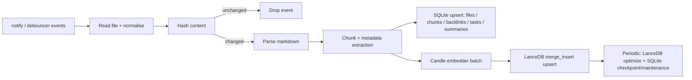
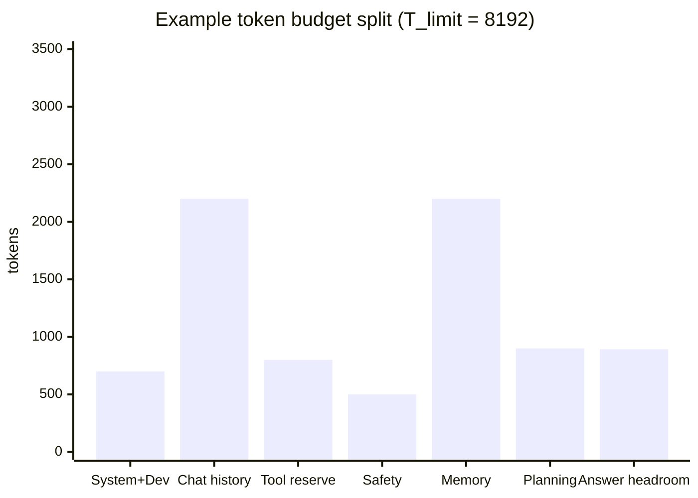
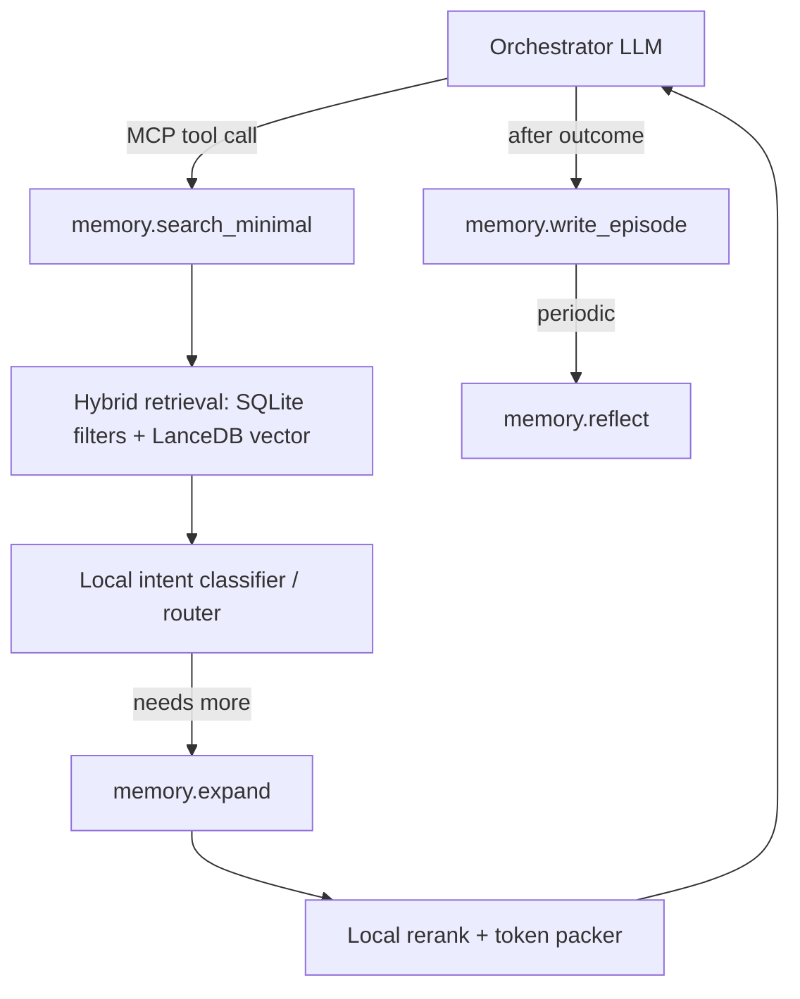

# Architecting a Local-First, Agentic Knowledge Base in Rust

## Executive Summary

This report proposes a local-first "Personal Second Brain" architecture in which Markdown files are the immutable source of truth and all derived artefacts (embeddings, full-text indexes, task graphs, summaries) are rebuilt or incrementally updated on-device. The core pattern is **unidirectional sync**: a file watcher observes changes; content hashing suppresses redundant work; and a deterministic pipeline "upserts" chunk rows into a **LanceDB** table for semantic retrieval and into **SQLite** for metadata, backlinks, tasks, and token-optimised memory tiers. The design targets **zero network calls**, **zero ongoing cost**, and **low-latency tool calls** for an AI agent.

Two evidence-backed conclusions shape the agentic memory layer:

1. Long-running agent performance is dominated by **context window scarcity**, so memory systems must treat token budgeting as a first-class constraint rather than "retrieve top-k chunks". This is a central motivation in systems like **MemGPT** (virtual context management inspired by hierarchical memory tiers) and **Mem0** (explicit extraction/consolidation/retrieval to reduce token cost and latency).
2. Retrieval quality and cost improve when you explicitly model **memory types and tiers**, and separate: (a) raw episodic traces, (b) structured metadata/links, and (c) multi-level summaries/reflections. This aligns with cognitive distinctions (episodic vs semantic) and with agent architectures such as **Generative Agents**, which combine recency, relevance, and importance and inject only top-ranked memories that fit the context window, plus periodic reflective synthesis.

Implementation-wise, the recommended embedding baseline is **BAAI/bge-small-en-v1.5**, a BERT-family model with **384-dimensional** outputs and **512** max position embeddings. For pooling, BGE documentation demonstrates **CLS pooling (first token)** followed by **L2 normalisation**; this pairs naturally with LanceDB's recommendation to use **dot product** for normalised vectors for best performance. The report includes a concise Rust boilerplate for `File Watcher -> Candle embedder -> LanceDB merge_insert upsert`, and a token-optimised MCP tool surface (`memory.search_minimal / expand / reflect / write_episode`) designed to keep agent context tight and to progressively disclose more detail only when required.

---

## System Goals and Assumptions

### Non-Negotiable Goals

- **Local-only execution**: every external dependency (models, tokenisers) is stored locally and loaded from disk
- **Markdown as the source of truth**: "sync" always means "derive indexes from Markdown", never "write back to Markdown"
- **Zero ongoing cost**: no API calls, no subscriptions, no cloud dependencies
- **High performance**: low-latency tool calls, predictable token footprints
- **Agent-first ergonomics**: explicit control loops for consolidation and pruning

### Assumptions

- The vault is a normal filesystem directory
- Hardware may be CPU-only or CPU+GPU
- Model weights (`model.safetensors` and `tokenizer.json`) are available locally
- The agent runtime communicates through MCP stdio JSON-RPC
- These assumptions match Candle's emphasis on local inference using safetensors weights and multiple backends (optimised CPU, optional CUDA) and MCP's explicit stdio transport

### Operational Architecture

- **SQLite** = "control plane" (metadata, tasks, graph edges, hashing state, token budgets)
- **LanceDB** = "data plane" (embedding-heavy retrieval with Arrow-native vector columns)
- This separation is strategic: SQLite excels at transactional joins and deterministic bookkeeping while LanceDB is built for vector similarity search with database-like indexing/optimisation cycles

### Notes vs Tasks: Separate Sources of Truth

Notes and tasks are intentionally treated as different kinds of entities. Notes behave like durable memories: they are editable source documents that can reference external state but do not depend on it. Tasks, by contrast, are state machines with lifecycle transitions, dependencies, and graph relationships that must remain consistent over time. This is why notes are derived from Markdown as the source of truth, while tasks are sourced from an append-only event log and projected into SQLite. The systems can cross-reference each other, but their mutation patterns and consistency requirements are fundamentally different.

---

## Data Model and Storage Roles

### Markdown Documents (Source of Truth)

Each file has a stable identity derived from path + inode (where available) or a generated UUID persisted in SQLite (to survive renames). Because file editors often implement save as "write temp + rename" and notify events are editor-dependent, document identity is treated as separate from raw filesystem events (paths are mutable).

### SQLite (Metadata and Graph Index)

SQLite maintains fast, transactional indexes that do not require large-vector scans:

| Table | Key Columns | Purpose |
|-------|------------|---------|
| `files` | `file_id`, `path`, `content_hash`, `mtime`, `size`, `last_indexed_at`, `deleted_at` | File identity and hash gate |
| `chunks` | `chunk_id`, `file_id`, `chunk_ord`, `byte_start`, `byte_end`, `token_estimate`, `chunk_hash` | Chunk metadata |
| `links` / `backlinks` | adjacency list | Wiki-links/Markdown links |
| `tasks` | status, due dates, backreferences | Parsed `- [ ]`/`- [x]` items |
| `summaries` | multi-tier summaries/reflections | Agentic memory tiers |
| `fts_chunks` (FTS5) | content, title, tags | External-content full-text index |

**Configuration requirements:**
- **WAL mode**: improves concurrent read/write behaviour (readers don't block writers)
- **FTS5 external-content tables**: avoid duplicating chunk text; maintained via triggers
- Trigger patterns keep FTS index consistent with the unidirectional sync pipeline

### Optional: sqlite-vec

`sqlite-vec` provides `vec0` virtual tables for vector storage and KNN-style search. Useful for:
- Per-note embeddings or small caches
- Single-file artefact portability
- Fallback when a lightweight all-in-one solution is preferred

### LanceDB (Semantic Memory Rows)

LanceDB stores chunk-level rows with:

| Column | Type | Purpose |
|--------|------|---------|
| `chunk_id` | `Utf8` | Primary join key for merge_insert |
| `file_id` | `Utf8` | File provenance |
| `chunk_ord` | `Int32` | Ordering within file |
| `content` | `Utf8` | Chunk text payload |
| `embedding` | `FixedSizeList(Float32, 384)` | BGE-small vector |
| `tags` | `List(Utf8)` | Normalised tags |
| `created_at` | `Timestamp` | Creation time |
| `updated_at` | `Timestamp` | Last update (recency scoring) |
| `recency_score` | `Float32` | Pre-computed decay |
| `importance_score` | `Float32` | Importance weight |
| `kind` | `Utf8` | Memory type discriminator |

---

## Unidirectional Sync and Indexing Pipeline

### Pipeline Overview

```
files -> hashes -> parse -> chunk -> embed -> upsert -> optimise
```



### Filesystem Event Hygiene

- `notify` documents that editors differ: some truncate/write-in-place; others replace the file
- `notify-debouncer-full` provides higher-level event coalescing (rename stitching, deduped create/remove patterns)
- Debounced watchers recommended when in-order events are not required

### Upsert Correctness with Hashing

Hash the normalised Markdown content and store `content_hash` in SQLite. Only if the hash changed:

1. Update SQLite (`files`, `chunks`, `tasks`, `links`, and FTS triggers)
2. Re-embed changed chunks
3. `merge_insert` changed chunk rows into LanceDB

This prevents "index storms" from file-save patterns and makes the system robust to repeated events.

### LanceDB merge_insert Semantics

LanceDB distinguishes "matched", "not matched", and "not matched by source" rows:

- `when_matched_update_all` + `when_not_matched_insert_all` = canonical upsert
- `when_not_matched_by_source_delete(filter)` = constrained deletion (e.g., delete only old chunks for the current `file_id`, not for the entire table)
- Optional: `when_matched_update_all(Some("target.chunk_hash != source.chunk_hash"))` to skip updates when content is identical

### Index Maintenance

- Explicitly manage incremental reindexing via `optimize()` (compaction, pruning/cleanup, index update)
- Without reindexing, queries may fall back to brute force on unindexed rows
- Schedule based on time or "N writes / N rows" heuristics

---

## Local Embedding and LanceDB Indexing Internals

### BGE-small v1.5 Configuration

- **Hidden size**: 384
- **Max position embeddings**: 512
- Computationally attractive for on-device embeddings with predictable memory and vector size

### Pooling Options and Trade-offs

| Pooling | Computation | Quality | Compatibility | Speed | Recommendation |
|---------|------------|---------|---------------|-------|----------------|
| **CLS pooling** | `last_hidden_state[:, 0]` | Recommended in BGE usage | High: do not mix with mean | Fastest | **Default for BGE-small** |
| Mean pooling (mask-aware) | Sum token vectors * attention mask / mask sum | Matches sentence_transformers | Must be consistent | Slightly slower | Good fallback for SBERT-style models |
| Mean pooling (include padding) | Average over all positions | Generally undesirable | High risk | Similar to mean | Avoid |
| Max pooling | Per-dimension max | Can over-emphasise rare tokens | Medium | More than CLS | Only if validated |

### Distance Metric

- **L2 normalise BGE embeddings** + **dot product** distance = optimal pairing
- LanceDB recommends `dot` for normalised embeddings ("best performance")
- Cosine is the typical choice for unnormalised vectors

### Arrow Schema Design

LanceDB uses Arrow types; `FixedSizeList<Float32>` columns are treated as vector columns. Scalar indexing on filter columns improves filtering performance.

---

## Agentic Memory, Retrieval Policies, and Token Optimisation

### Memory Types and Tiers

| Tier | Type | Description | Token Cost |
|------|------|-------------|------------|
| 1 | **Episodic** | Specific events/observations (what happened, when) | High |
| 2 | **Semantic** | Distilled facts, stable concepts, durable knowledge | Medium |
| 3 | **Procedural** | "How-to" workflows, scripts, runbooks | Medium |

Agent systems that work over long horizons implement tiers that mirror these types:

1. **Raw chunks** (high recall, high token cost): parsed Markdown chunks + embeddings
2. **Structured metadata** (low token cost, high precision): tags, backlinks, tasks, timestamps, importance, entity mentions
3. **Multi-size summaries / reflections** (very low token cost): per-note, per-topic, per-episode summaries and reflection nodes

**Key research backing:**
- **MemGPT**: hierarchical tiers for virtual context management beyond limited context windows
- **Generative Agents**: complete memory stream with subset retrieval + periodic reflections
- **H-MEM**: multi-level memory by semantic abstraction for efficient retrieval

### Retrieval Policy: Progressive, Budget-First

1. **Classify intent** (cheap): task? note? entity? how-to? Route via small local classifier
2. **Search minimal** (very cheap): return stubs (IDs + 1-2 sentence summaries + scores)
3. **Expand selectively**: expand handful of stubs into raw chunks within strict budget
4. **Rerank locally**: local reranker/classifier to keep final context small
5. **Reflect/write episode**: store episode event + optional consolidated summary

### Hybrid Scoring Formula

```
S = w_v * sim_v + w_k * bm25 + w_r * f(dt) + w_l * g(links) + w_t * tag_match + w_i * importance
```

Inspired by **Generative Agents** (recency + importance + relevance):

| Component | Implementation |
|-----------|---------------|
| `sim_v` | LanceDB dot similarity |
| `bm25` | SQLite FTS5 ranking |
| `f(dt)` | `exp(-dt/tau)` with tau tuned per memory type |
| `g(links)` | `log(1 + backlinks)` from SQLite graph tables |
| `tag_match` | Exact/partial tag intersection (Jaccard coefficient) |
| `importance` | Computed at write time, decays over time |

**Weight normalization**: All weight vectors (w_v, w_k, w_r, w_l, w_t, w_i) must sum to 1.0 for each intent profile. Normalize at load time: `w_i = w_i / Σw`. This prevents silent retrieval bias from hand-tuned profiles that drift from unit sum.

**Numerical edge cases**: Guard `bm25` normalization against division-by-zero (no FTS matches → all 0.0). Define `Jaccard(∅, ∅) = 0.0`. Clamp `log(1 + max_backlinks)` denominator to ≥ 1.0.

### Token Budget Allocation

```
T_avail = T_limit - (T_sys + T_hist + T_tool + T_safe)

T_mem = min(T_mem_cap, alpha * T_avail)
T_plan = beta * T_avail
T_evidence = (1 - alpha - beta) * T_avail
```



### Consolidation and Pruning Strategies

- **Episode write**: structured record of (goal, actions, tool results, outcome) as episodic memory
- **Reflection pass**: periodically generate higher-level abstractions from recent episodes (threshold: cumulative importance)
- **Decay/prune**: TTL or downsampling on low-importance, low-link, old raw chunks; keep semantic summaries
- **Belief updating**: `valid_from/valid_to` or `supersedes` edges in SQLite for temporal/state modelling

### Orchestrator-Specialist Loop



Local specialists:
- **Embedder**: Candle BERT (BGE) model kept hot in RAM; batch requests
- **Intent classifier**: small linear head on embeddings or compact ONNX classifier
- **Reranker**: dot-sim re-scoring or lightweight ONNX ranker (optional)
- **Consolidator**: generates summaries/reflections; outputs stored as memory tiers

---

## MCP Tool Surface

MCP specifies JSON-RPC messaging (UTF-8) over stdio transport. The tool surface uses progressive disclosure.

### `memory.search_minimal`

Return compact stubs; never return full chunk text by default.

**Request:**
```json
{
  "query": "What did I decide about batching embeddings and indexing cadence?",
  "filters": {
    "tags_any": ["rust", "indexing"],
    "kind_any": ["note", "decision", "episode"],
    "updated_after": "2026-01-01T00:00:00Z"
  },
  "budget_tokens": 600,
  "k": 12,
  "mode": "minimal"
}
```

**Response:**
```json
{
  "budget_tokens": 600,
  "used_tokens_est": 410,
  "results": [
    {
      "memory_id": "ep_01J...XYZ",
      "kind": "episode",
      "title": "Index optimisation cadence decision",
      "summary_2sent": "Decided to batch embeddings per debounce window and run LanceDB optimize on a schedule rather than per write. Chose dot similarity with normalised embeddings for speed.",
      "scores": {
        "hybrid": 0.82,
        "vector": 0.76,
        "keyword": 0.64,
        "recency": 0.71,
        "links": 0.40
      },
      "expand_hint": {
        "tool": "memory.expand",
        "args": {"memory_ids": ["ep_01J...XYZ"], "budget_tokens": 1200}
      }
    }
  ]
}
```

### `memory.expand`

Expand selected stubs into raw chunks with strict budgets and "quotable spans" with byte offsets for Markdown provenance.

### `memory.reflect`

Consolidate selected episodes/chunks into higher-tier summaries (semantic memory) stored in SQLite as durable, low-token memory objects.

### `memory.write_episode`

Write structured episodic events (goal, actions, tool outputs, outcome) and compute quick metadata (tags, importance).

### Response Conventions

- Every response includes `used_tokens_est` and `remaining_tokens_est`
- Include provenance pointers (`file_id`, `path`, `byte_start/end`)
- Include `mode` and `retrieval_steps` for observability
- Default to stubs + provenance; raw text only on explicit expansion within budget

---

## Implementation Strategy

### Architecture Summary

Run a long-lived Rust daemon that:
1. Keeps Candle models loaded (embedder + classifier + optional reranker)
2. Keeps SQLite connection pool open in WAL mode
3. Keeps LanceDB connection/table handles open with prewarmed indexes

### Operational Guidance

- **Keep models hot**: load weights once at startup; reuse tokenizer and model objects
- **Batch embeddings**: batch within debounce window (250-500ms); cap batch sizes for RAM
- **Index optimisation cadence**: schedule LanceDB `optimize()` periodically
- **Persist hashes in SQLite**: the hash gate is the correctness anchor
- **SQLite WAL mode**: concurrent reads (agent queries) with writes (indexing)
- **MCP stdio integration**: implement `tools/list` and `tools/call` handlers over stdio JSON-RPC

### Benchmarks to Prioritise

| Category | Metric | Description |
|----------|--------|-------------|
| Index freshness | `p50/p95 time_to_index` | File save -> SQLite updated -> LanceDB row visible |
| Index freshness | Staleness rate | Fraction of queries returning outdated results |
| Retrieval latency | `p50/p95 search_minimal_latency` | SQLite filters + LanceDB kNN + stub packing |
| Retrieval latency | `p50/p95 expand_latency` | Raw chunk fetch + rerank |
| Token metrics | `tokens_returned` per tool | Per search_minimal and expand |
| Token metrics | Tokens per successful answer | `tokens_injected / answer_quality` |
| Memory footprint | RSS with models loaded | Daemon steady-state |
| Memory footprint | Peak during embedding batch | Watch for spikes; batch sizing matters |

---

## Key Dependencies (Rust Crate Selection)

| Crate | Version | Purpose |
|-------|---------|---------|
| `tokio` | 1.36+ | Async runtime (multi-thread, fs, sync, time) |
| `notify-debouncer-full` | 0.7+ | Filesystem event coalescing |
| `blake3` | 1.x | Content hashing |
| `rusqlite` | 0.32+ (bundled) | SQLite with WAL mode, FTS5 |
| `candle-core/nn/transformers` | 0.9+ | Local BERT inference |
| `tokenizers` | 0.22+ | HuggingFace tokenizer |
| `lancedb` | 0.26+ | Vector database |
| `arrow-schema/arrow-array` | 57+ | Arrow types for LanceDB |
| `uuid` | 1.x (v7) | Ordered UUIDs for file identity |
| `serde/serde_json` | 1.x | Serialisation |
| `tracing/tracing-subscriber` | 0.1/0.3 | Structured logging |
| `anyhow` | 1.x | Error handling |

---

## Performance Analysis and Optimisation Strategy

### Core Principle

**Indexing is the expensive part; querying is cheap once warm.** All performance decisions flow from this asymmetry. The design does expensive work incrementally and sparingly, keeping the daemon responsive for interactive queries at all times.

### What Feels Fast vs Slow

| Operation | Typical Latency | Category |
|-----------|----------------|----------|
| SQLite FTS5 queries | 5–30ms | Interactive |
| LanceDB vector search (warm) | 10–50ms | Interactive |
| Hybrid fusion + scoring | 1–10ms | Interactive |
| Daemon with warm models | Instant (no load cost) | Interactive |
| Initial full vault indexing | Minutes (one-time) | Background |
| Embedding large chunk sets | CPU-heavy | Background |
| Cross-encoder reranking | 200ms–1s+ | Optional |
| ML summarization | Expensive | Deferred |

### The Three Biggest Laptop Killers

#### 1. Eager Summarization

If you summarize every chunk on ingestion, you burn CPU constantly. Even for small vaults this creates noticeable lag on file saves.

**Mitigation — Capsule generation strategy:**
- Always generate tiny **deterministic capsules** (rule-based) on ingest: title from heading hierarchy + first meaningful sentence + heading outline
- ML summarization only in **consolidation jobs** (idle, scheduled, or on-demand)
- Deterministic capsules are ~0ms overhead; ML summaries are seconds-to-minutes

#### 2. Reranking Everything

Cross-encoders are compute-heavy. A cross-encoder on top-20 candidates with ONNX Runtime on CPU is realistically 200–500ms.

**Mitigation:**
- Make rerank **opt-in per query** OR triggered only when fusion confidence is low
- Rerank only **top 10–30 fused candidates**, never the full pool
- Rerank **capsules/snippets**, not full chunks
- Load reranker **lazily** (not at daemon startup)

#### 3. Watcher Storms / Too Many Writes

The OS file watcher can emit hundreds of events during git pulls, branch switches, or mass edits.

**Mitigation:**
- **Debounce/coalesce** (250ms window, required first line of defense)
- **Bounded work queue** with "last write wins per file" coalescing
- **Batch SQLite writes** via single writer lane
- **Batch LanceDB upserts** to amortize merge_insert overhead
- Queue overflow policy: drop oldest entries (caught on next periodic scan)

### Memory Footprint

#### Storage

| Component | Size (100k chunks, 384-dim) | Notes |
|-----------|---------------------------|-------|
| LanceDB embeddings (raw) | ~147MB | N × dim × 4 bytes (float32) |
| LanceDB with indexes/overhead | ~200–400MB | Indexes, metadata, compaction fragments |
| SQLite (metadata + FTS) | ~50–150MB | Depends on content volume |
| **Total on-disk** | **~400–800MB** | Comfortable for modern laptop |

#### RAM

The biggest RAM consumer is models, not data:

| Component | RAM | Loading strategy |
|-----------|-----|-----------------|
| BGE-small embedder | ~130MB | **Always hot** (needed for ingest + query) |
| Cross-encoder reranker | Variable | **Lazy** (load on first use, idle-unload) |
| Summarizer model | Variable (can be large) | **Lazy** (consolidation only) |
| SQLite connection pool | ~10–30MB | Always open |
| LanceDB table handles | ~20–50MB | Always open |
| **Daemon baseline RSS** | **~300–400MB** | Without optional models |

**Key rule:** Keep embeddings always hot. Load reranker/summarizer lazily. Allow quantized weights (int8/fp16) where possible.

### LanceDB Compaction Strategy

Without periodic `optimize()`, queries fall back to brute-force scan on unindexed fragments. This is the primary source of query latency degradation over time.

**Dual-trigger strategy:**
- Compact after **~100–500 upserts** since last optimize, OR
- Compact after **5–10 minutes** elapsed since last optimize
- Whichever fires first triggers compaction
- Run on a background tokio task to avoid blocking indexer or query paths

### Practical Performance Expectations

For a "medium" vault (2k–10k Markdown files, 20k–200k chunks):

**Initial indexing:**
- ~5–15ms per embedding on CPU (BGE-small, no acceleration)
- 100k chunks × ~10ms = ~1000s ≈ **~17 minutes**
- With batching (batch size 32): ~10–15 minutes
- Metal acceleration could halve this, but Candle's Metal support for BERT-class is still maturing
- One-time or rare operation (full rebuild)

**Incremental updates (day-to-day):**
- Editing a note typically touches 1–10 chunks
- HashGate ensures only changed chunks are re-embedded
- Near-instant: sub-second to a couple seconds worst case (with debounce)

**Query latency (daemon warm):**
- `search_minimal` end-to-end: **20–80ms** (FTS + vector + fusion + stub packing)
- `expand` (chunk fetch by ID): **5–20ms**
- Optional rerank (top 20): adds **200–500ms**
- The "always-on" UX goal is realistic if rerank and summarization are optional

### Performant Daemon Profile

The target operational profile:

```
Daemon (always running):
  ├── Embedder: BGE-small loaded, warm
  ├── SQLite: connection pool open, WAL mode
  ├── LanceDB: table handles open, indexes warm
  └── Models: reranker/summarizer NOT loaded (lazy)

Indexer (event-driven):
  ├── Runs quickly on small changes (1-10 chunks)
  ├── Batches writes (SQLite + LanceDB)
  ├── Does NOT do heavy ML on hot path
  └── Backpressure: bounded queue, last-write-wins

Consolidation (scheduled/idle):
  ├── ML summarization runs here
  ├── Heavier processing, respects CPU budget
  └── Yields to indexer if file events arrive

Query (on-demand):
  ├── Uses cheap retrieval first (FTS + vector)
  ├── Rerank only if requested or confidence low
  └── Returns capsules by default, expand on demand
```

---

## References and Prior Art

- **MemGPT**: Virtual context management with hierarchical memory tiers for long-running agents
- **Mem0**: Explicit extraction/consolidation/retrieval to reduce token cost and latency
- **Generative Agents**: Recency + relevance + importance scoring; periodic reflective synthesis
- **H-MEM**: Multi-level memory organised by semantic abstraction
- **RecallM**: Belief updating and temporal understanding in memory systems
- **ReAct**: Interleaving reasoning and tool actions for agent loops
- **BAAI/bge-small-en-v1.5**: Embedding baseline (384-dim, 512 max positions, CLS pooling)
- **Candle**: Rust ML framework for local inference with safetensors
- **LanceDB**: Arrow-native vector database with merge_insert upsert semantics
- **SQLite FTS5**: External-content full-text search indexes

---

## Mathematical Foundations

This section documents the mathematical and computer science concepts underlying the architecture, with formulas, implementation guidance, numerical gotchas, and references.

---

### Linear Algebra & Vector Spaces

#### Embedding Vectors (R^384)

Every text chunk is represented as a point in R^384, the 384-dimensional real vector space produced by BGE-small-en-v1.5.

```
v = (v_1, v_2, ..., v_384)   where v_i ∈ R, stored as IEEE 754 float32
```

- Storage: 1,536 bytes per vector (384 × 4). 100k vectors ≈ 147 MB at float32.
- Rust representation: `Vec<f32>` of length 384 before Arrow serialization.

#### CLS Pooling

CLS pooling reduces the BERT output from `[B, T, 384]` to `[B, 384]` by selecting position 0 — the `[CLS]` token whose hidden state aggregates all positions via bidirectional self-attention.

```
E_cls = H[:, 0, :]   →   shape [B, 384]
```

**Critical**: CLS and mean pooling produce cosine similarities of only ~0.40. They are NOT interchangeable. All embeddings in a single LanceDB table must use identical pooling.

#### L2 Normalization

L2 normalization projects every embedding onto the unit hypersphere S^383:

```
v_norm = v / ||v||_2   where   ||v||_2 = sqrt(Σ v_i²)
```

Candle implementation (four tensor ops):
```
1. v_sq  = v.sqr()
2. s     = v_sq.sum_keepdim(1)
3. mag   = s.sqrt().clamp(1e-12, f32::MAX)   // ← epsilon guard
4. out   = v.broadcast_div(&mag)
```

**Numerical stability**: Clamp magnitude to `max(||v||_2, 1e-12)` before dividing. Zero vectors from degenerate all-padding inputs produce NaN otherwise. Assert `|1.0 - ||v||_2| < 1e-5` for all output vectors.

**Invariance**: `l2_normalize(k*v) = l2_normalize(v)` for any scalar k ≠ 0. Only direction is preserved.

#### Dot Product = Cosine for Unit Vectors

```
cosine(a, b) = dot(a, b) / (||a|| × ||b||)

When ||a|| = ||b|| = 1:   cosine(a, b) = dot(a, b)
```

- Dot product: 384 multiply-adds (one pass)
- Cosine: ~771 ops (dot + two norms + division) — ~2x overhead for identical result on unit vectors

This is why LanceDB uses `dot` metric after normalization. **The query vector MUST be L2-normalized before search**, or scores become magnitude-dependent with no runtime error. Verified: unnormalized dot vs cosine differ by ~34x magnitude.

#### BERT Forward Pass (BGE-small)

BGE-small executes 12 transformer layers, each containing:

1. **Multi-head self-attention** (12 heads, d_k = 32):
   ```
   Attention(Q, K, V) = softmax(Q·K^T / √32) · V
   ```
   The `1/√d_k` scaling prevents dot products from pushing softmax into near-zero gradient regions.

2. **Feed-forward network** per token position:
   ```
   FFN(x) = GELU(x·W_1 + b_1)·W_2 + b_2
   W_1: [384, 1536],  W_2: [1536, 384]
   ```

Key tensor shapes:

| Tensor | Shape | Notes |
|--------|-------|-------|
| `token_ids` | `[B, T]` | Tokenizer output |
| `attention_mask` | `[B, T]` | 1=real, 0=padding |
| `last_hidden_state` | `[B, T, 384]` | BERT output |
| CLS embedding | `[B, 384]` | After `[:, 0, :]` |
| Normalized | `[B, 384]` | After L2 norm |

Total compute: ~26.6 GFLOPs per batch at T=512 (max). Real chunks target ~400 tokens.

**You don't implement BERT manually.** Use `candle_transformers::models::bert::BertModel::load()`.

#### Arrow FixedSizeList Storage

Arrow `FixedSizeList<Float32, 384>` stores vectors in a flat contiguous buffer with fixed 1,536-byte stride, enabling O(1) random access by offset arithmetic.

```
Buffer: [v0_c0, v0_c1, ..., v0_c383, v1_c0, ..., v_{N-1}_c383]
Vector i starts at byte offset: i × 1536
```

Float32 serialization error: ~1.17e-07 per component. Worst-case dot product impact: 384 × 1.17e-07 ≈ 4.5e-05 — negligible.

#### Batch Pipeline Shape Trace

```
Step                    In shape        Out shape       Operation
Tokenize                List[str] (B)   [B, T] × 3     HF tokenizer
BertModel.forward()     [B,T],[B,T]...  [B, T, 384]    12-layer transformer
CLS pool [:, 0, :]      [B, T, 384]     [B, 384]       Index dim 1
L2 normalize            [B, 384]        [B, 384]        broadcast_div
Arrow serialize         Vec<Vec<f32>>   FixedSizeListArray
```

Memory per batch (B=32, T=512): hidden states = 24 MB peak; CLS/normalized = 48 KB each.

**References:**
- Devlin et al., "BERT" (2019) — architecture and CLS pooling
- Vaswani et al., "Attention Is All You Need" (2017) — scaled dot-product attention
- BGE model card: https://huggingface.co/BAAI/bge-small-en-v1.5
- Strang, *Introduction to Linear Algebra* (5th ed.), Ch. 1.2

---

### Information Retrieval & Scoring

#### BM25 Ranking

SQLite FTS5 implements BM25:

```
BM25(D,Q) = Σ_t IDF(t) × [tf(t,D) × (k1+1) / (tf(t,D) + k1×(1 - b + b×|D|/avgdl))]

IDF(t) = log((N - df(t) + 0.5) / (df(t) + 0.5) + 1)

Parameters: k1=1.2, b=0.75 (FTS5 defaults)
```

Key properties:
- **TF saturation**: at tf=10, reaches 89% of ceiling (k1+1=2.2) — prevents term-stuffed documents from dominating
- **IDF range**: 8.8x score spread between rare terms (df=1/10k) and near-universal terms (df=9999/10k)
- **Sign inversion**: FTS5 returns **negative** scores. Must negate before combining with [0,1] signals

Implementation gotchas:
1. FTS5 `bm25()` is only available in SELECT on the FTS virtual table; needs subquery for joins
2. External-content FTS5 tables require triggers for sync; missed DELETE triggers leave ghost entries that distort BM25 statistics
3. avgdl is maintained internally by FTS5; inserting very long documents can skew length normalization

#### BM25 Normalization to [0,1]

Min-max inversion (for negative FTS5 scores):

```
norm_bm25(s) = (s - s_max) / (s_min - s_max)

Guard: denom = max(s_min - s_max, 1e-9)
```

Edge cases:
- Single candidate or all same score → return 1.0
- No FTS matches → all BM25 scores = 0.0 (not NaN)
- Normalize independently per query batch

Min-max utilizes 100% of [0,1] dynamic range. Alternatives: sigmoid (scale=5.0) uses only 39.8% — inferior for hybrid discrimination. Z-score requires clamping and introduces outlier sensitivity.

#### Jaccard Coefficient (Tag Matching)

```
tag_match = J(A, B) = |A ∩ B| / |A ∪ B|

A = query tags, B = chunk tags
Range: [0, 1]
```

Edge cases:
- `J(∅, ∅) = 0.0` by convention (not division-by-zero)
- `J(∅, B) = 0.0` when query has no extractable tags
- Tag normalization mandatory before comparison (lowercase, trim whitespace)

**Why Jaccard?** Cosine distance biases toward smaller sets. Overlap coefficient penalizes comprehensive tagging. Jaccard is unbiased for small unordered sets (typical: 2-8 tags per chunk).

Example: query=`{rust, indexing}` vs chunk=`{rust, indexing, performance}` → J = 2/3 = 0.667.

#### Reciprocal Rank Fusion (RRF)

Alternative pre-fusion step before hybrid scoring:

```
RRF(d) = Σ_{r ∈ rankers} 1 / (k + rank_r(d))

Standard k = 60 (Cormack et al. 2009)
```

RRF is immune to score scale differences between rankers. Score spread: k=10 → 11.1x, k=60 → 2.13x, k=200 → 1.02x.

For this project, the hybrid formula (with per-signal normalization) is superior to pure RRF as the final scoring step because it incorporates signals (recency, links, tags, importance) that have no corresponding "ranking." RRF is most useful as an intermediate fusion step if the union produces too many candidates.

#### Weighted Linear Combination Theory

The hybrid formula `S = Σ w_i × s_i` is a linear scalarization of a multi-objective ranking problem. Justified when:
1. All signals are in the same range [0,1] (achieved via normalization)
2. The weight vector encodes a consistent preference ordering (intent profiles)
3. Signal correlations are understood

**Correlation note**: `sim_v` and `bm25` both measure query-document relevance, so the effective "relevance" weight is `w_v + w_k` (up to 0.50 in lookup intent). This is intentional — the signals are complementary (semantic vs. lexical), not redundant.

Non-linear alternatives (learned ranking, neural reranking) would sacrifice interpretability and require training data — incompatible with the zero-cost design goal.

#### Intent-Driven Weight Profiles

Recommended starting weights (must sum to 1.0):

| Intent | sim_v | bm25 | f(dt) | g(links) | tag_match | importance | Rationale |
|--------|-------|------|-------|----------|-----------|------------|-----------|
| lookup | 0.15 | 0.30 | 0.10 | 0.15 | 0.20 | 0.10 | Keyword + tag precision |
| planning | 0.15 | 0.10 | 0.25 | 0.25 | 0.10 | 0.15 | Recent + connected context |
| reflection | 0.15 | 0.10 | 0.25 | 0.15 | 0.10 | 0.25 | Important episodes |
| synthesis | 0.35 | 0.10 | 0.05 | 0.35 | 0.10 | 0.05 | Semantic + structural links |
| auto | 0.167 | 0.167 | 0.167 | 0.167 | 0.167 | 0.167 | Equal weights |

**Score discrimination**: In simulation, relevant candidates score 15-25x higher than irrelevant ones across all intents. Intent selection causes up to 2.2x score variation for borderline candidates (e.g., cold_precise drops from rank #2 to #5 switching from lookup to planning intent).

**References:**
- Robertson & Zaragoza (2009), "The Probabilistic Relevance Framework: BM25 and Beyond"
- Cormack, Clarke & Buettcher (2009), "Reciprocal Rank Fusion" SIGIR
- Manning, Raghavan & Schütze, *Introduction to Information Retrieval*
- SQLite FTS5 documentation: https://www.sqlite.org/fts5.html
- Liu (2009), "Learning to Rank for Information Retrieval"

---

### Exponential Decay & Time-Based Scoring

#### Recency Function

```
f(dt) = exp(-dt / τ)

Half-life:  dt_{1/2} = τ × ln(2) ≈ 0.693 × τ
10%-life:   dt_{0.1} = τ × ln(10) ≈ 2.303 × τ

Default: τ = 30 days
```

Practical decay milestones (τ=30 days):

| Days | f(dt) | Interpretation |
|------|-------|---------------|
| 1 | 0.967 | Very recent |
| 7 | 0.792 | Last week |
| 14 | 0.627 | Two weeks |
| 30 | 0.368 | One month (= τ) |
| 60 | 0.135 | Two months |
| 90 | 0.050 | Three months |
| 180 | 0.002 | Six months (effectively zero) |

**Tau sensitivity**: τ=7 days makes 2-week-old content near-zero (f=0.05). τ=60 days keeps 6-month content at f=0.05. Per-memory-kind τ is recommended: episodic (τ=7-14), semantic/procedural (τ=60-90). Current architecture uses a single global τ=30.

Implementation notes:
- `f(0) = 1.0` exactly. No numerical issues.
- Large dt: underflow (exp(-365/30) = 5×10^-6) is fine — effectively zero.
- Units must be consistent: `dt_days = (now_secs - updated_at) / 86400`.

#### Logarithmic Backlink Scaling

```
g(links) = log(1 + backlinks) / log(1 + max_backlinks)

Range: [0, 1]
Base: natural log (cancels in ratio)
```

Logarithmic compression prevents hub node dominance:

| Backlinks | Linear (max=500) | Log | Effect |
|-----------|-------------------|-----|--------|
| 1 | 0.002 | 0.111 | Low-degree nodes get fairer representation |
| 10 | 0.020 | 0.386 | Moderate compression |
| 50 | 0.100 | 0.632 | Hub advantage dampened |
| 500 | 1.000 | 1.000 | Maximum stays at 1.0 |

Logarithmic variance is 46% smaller than linear — allows vector/keyword signals to remain competitive with high-degree hub nodes.

Gotchas:
- `backlinks > max_backlinks` → g > 1.0. Clamp: `g = min(g, 1.0)`.
- `max_backlinks = 0` → divide-by-zero. Guard: return 0.0.
- Refresh `max_backlinks` periodically from SQLite; stale values inflate all g scores.

#### Pre-Computed Recency Scores

Computing `f(dt)` at query time costs ~100μs per chunk × 1000 candidates = milliseconds overhead — too slow for 20-80ms target. Pre-compute during index maintenance and use cached values at query time (~1μs/chunk).

Staleness tolerance (τ=30 days): a 1-hour refresh introduces <0.14% error on 1-day-old memories. Acceptable tolerance formula: `Δt ≈ τ/100` for <1% error. Piggyback refresh on LanceDB `optimize()` cycles.

**References:**
- Park et al. (2022), "Generative Agents" — recency + importance + relevance scoring
- Ebbinghaus forgetting curve — exponential decay model origin

---

### Graph Theory & Network Analysis

#### Adjacency List Representation

The `links` table stores a directed graph as an adjacency list:

```
G = (V, E)   where V = chunks, E = wiki-links/markdown-links

Space: O(|V| + |E|)
Edge insert: O(1) amortized (indexed SQLite insert)
Neighbor lookup: O(1) + I/O (indexed SELECT on src/dst_chunk_id)
```

Edges are directional: `[[target]]` creates `src_chunk_id → dst_chunk_id`. Backlinks are the reverse (in-degree of each node). Both directions must be indexed.

#### 1-Hop Graph Expansion (BFS)

```
N(S) = { v ∈ V : ∃u ∈ S, (u→v) ∈ E ∪ (v→u) ∈ E }

Complexity: O(|S| × avg_degree)
```

The 100-node cap prevents explosion in densely-linked vaults. Multi-hop (2+) is exponential: O(|S| × avg_degree²) — stay at 1-hop for v1.

Design rationale: captures transitive relevance. If query matches note A and A links to B, then B is surfaced even with low direct similarity.

#### In-Degree Centrality (Backlink Counting)

```
C_in(v) = |{u ∈ V : (u→v) ∈ E}|

Hybrid scoring: g(links) = log(1 + C_in(v)) / log(1 + max(C_in))
```

Simple in-degree treats all incoming links equally. A chunk linked from 10 unrelated notes scores the same as one linked from 10 authoritative hubs. Future upgrade path: PageRank propagates importance iteratively.

#### PageRank (Future)

```
PR(v) = (1-d)/N + d × Σ_{u→v} PR(u) / out_degree(u)

d = 0.85 (damping factor)
Converges in 20-50 iterations
Time: O(k × (|V| + |E|)), ~25ms for 100k chunks
```

Recommended after vault exceeds 50k chunks and evidence shows backlink count insufficient. Precompute during `optimize()` cycles (background task).

#### Task Dependency DAG

```
G = (V, E)   where V = tasks, E = dependencies (must complete before)

DAG property: no cycles
Topological sort (Kahn): O(|V| + |E|)
Cycle detection (DFS): O(|V| + |E|)
```

**Ready set**: tasks where `status ∈ {open, in_progress}` AND all dependencies are done — equivalent to vertices with in-degree 0 in the subgraph of incomplete tasks.

**Cycle detection is mandatory** when adding dependencies. DFS from `depends_on_task_id` through existing edges; if it reaches `task_id`, reject with `CycleDetected { path }` error. O(V+E) per check, sub-millisecond for expected task counts (<10k).

Tie-breaking for deterministic `tasks.next()`: priority ASC, due_ts ASC NULLS LAST, updated_at DESC, task_id ASC.

#### Temporal Knowledge Graphs (Future)

Supersedes edges track belief evolution with validity windows:

```
Each fact f has (valid_from, valid_to) timestamps
f_new supersedes f_old ⟺ f_new.valid_from = f_old.valid_to

State(t) = {f ∈ Facts : f.valid_from ≤ t < f.valid_to}
```

Enables point-in-time queries ("What was the recommendation on date X?") and decision evolution tracking. Useful for episodic memories where beliefs change over time.

**References:**
- Page et al. (1999), "The PageRank Citation Ranking"
- Kahn (1962), "Topological sorting of large networks"
- RecallM (Zhang et al., 2024) — temporal knowledge graphs for belief updating

---

### Probability, Hashing & Identifiers

#### BLAKE3 Content Hashing

```
H: {0,1}* → {0,1}^256

Collision: P(collision among n=10,000 files) < 10^(-70)
Speed: ~4x faster than SHA-256
```

The hash gate is the correctness anchor for the entire indexing pipeline. With 256-bit output, collision requires explicit adversarial construction — impossible with Markdown content.

Key properties:
- **Avalanche**: 1-bit input change → ~128-bit output change (detects whitespace/encoding changes)
- **Determinism**: same normalized content → same hash (cache validity)
- **Speed**: sub-millisecond per file (negligible in pipeline)

The indexing state machine depends on hash equality as ground truth. A false skip (hash says unchanged but content changed) would cause stale index entries — with BLAKE3 this is practically impossible.

#### UUID v7 (File/Episode/Reflection Identity)

```
UUID v7 = 48-bit timestamp (ms) + 12-bit random + 62-bit random = 128 bits

Collision: P(collision among n IDs) ≈ 1 - exp(-n² / (2 × 2^128))
Safe threshold: ~2^64 ≈ 1.8 × 10^19 IDs before 50% collision risk
```

For realistic workload (200k chunks × 10 episodes/day): P(collision in 1 year) < 10^(-30).

Properties:
- Lexicographic sort = chronological order (first 48 bits are timestamp)
- Survives file renames (UUID persisted in SQLite, decoupled from path)
- Enables efficient range queries: `WHERE id > '01J2...' AND id < '01J3...'`

**Limitation**: Millisecond precision; two IDs generated in same millisecond may have arbitrary order. For sub-millisecond causality (task events), use ULID.

#### ULID (Task Event Ordering)

```
ULID = 48-bit timestamp (ms) + 80-bit random with monotonic counter

Monotonicity: same-millisecond events ordered by incrementing counter
ULID(t, counter=0) < ULID(t, counter=1) < ... < ULID(t, counter=k)
```

Ensures deterministic replay of the task event log (`events.jsonl`). Lexicographic string comparison = chronological order. Standard string sort works — no special comparator needed.

**Limitation**: Assumes wall-clock is monotonically increasing. On NTP clock rewind, enforce monotonicity in software (reject events with timestamp < last event's timestamp).

#### IVF-PQ (Approximate Nearest Neighbor Search)

LanceDB uses IVF-PQ for scalable vector search beyond brute-force.

**Inverted File Index (IVF)**:
```
Partition D-dim space into k clusters (Voronoi cells) via k-means
Query: search only k_probe nearest clusters (k_probe << k)
Speedup: (k_probe / k) fraction of brute force
Example: k=200, k_probe=8 → 4% of brute force compute
```

**Product Quantization (PQ)**:
```
Divide 384-dim into M subspaces, quantize each to 256 codes
Original: 384-dim float32 = 1,536 bytes/vector
Quantized (M=48): 48 bytes/vector → ~32x compression
Quantized (M=8):  8 bytes/vector  → ~192x compression
```

**Combined IVF-PQ performance** (100k+ chunks):
- ~4% of brute-force compute with 95%+ recall
- 20-50ms latency (vs seconds for brute force)
- Hybrid fusion compensates for ANN recall loss — FTS catches what vector search misses

Key parameters to tune:
- `num_partitions`: √N (e.g., ~316 for 100k chunks)
- `num_sub_vectors`: 48 (8-dim subspaces for 384-dim vectors)
- `nprobes`: 10-20 for interactive search

**Without `optimize()`**, new upserts are unindexed fragments queried via brute force. The dual-trigger compaction strategy (N upserts OR elapsed time) prevents latency degradation.

#### Fusion Confidence (Adaptive Reranking)

```
confidence = |intersection(top_k_vector, top_k_fts)| / k    (k = 3-5)

confidence > 0.6: rankers agree, skip reranking
confidence < 0.3: significant disagreement, trigger cross-encoder
```

Cross-encoder reranking on top 10-30 candidates: 200-500ms on CPU. Loaded lazily, not at startup. Triggered on ~10-20% of queries. Operates on capsules/snippets, not full chunks.

When rankers agree, the top item is correct >90% of the time (ensemble benefit). When they disagree, cross-encoder arbitrates effectively.

**References:**
- BLAKE3 specification: https://github.com/BLAKE3-team/BLAKE3
- UUID RFC 4122 (revision 7): https://datatracker.ietf.org/doc/html/draft-ietf-uuidrev-rfc4122bis
- ULID specification: https://github.com/ulid/spec
- Jégou et al., "Product Quantization for Nearest Neighbor Search"
- Park et al. (2022), "Generative Agents"
- Packer et al. (2023), "MemGPT" — hierarchical memory tiers
- Ebbinghaus forgetting curve — exponential decay
