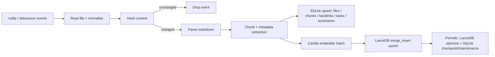
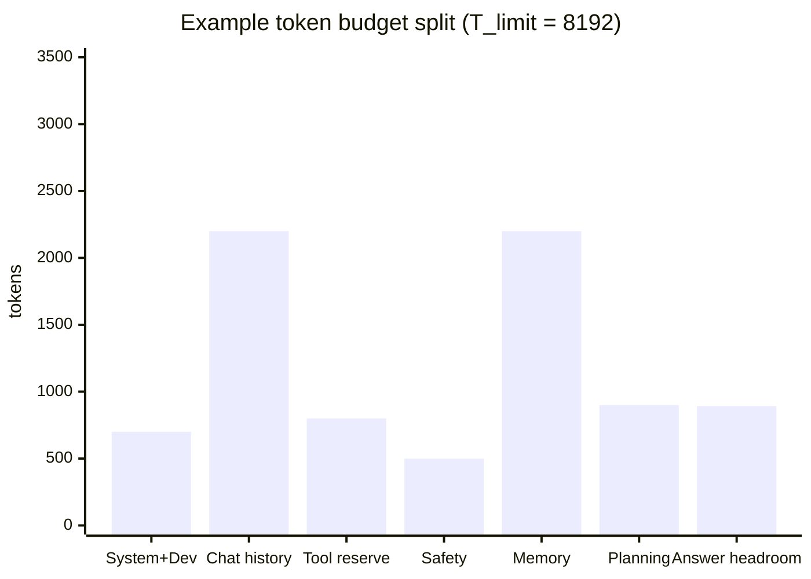
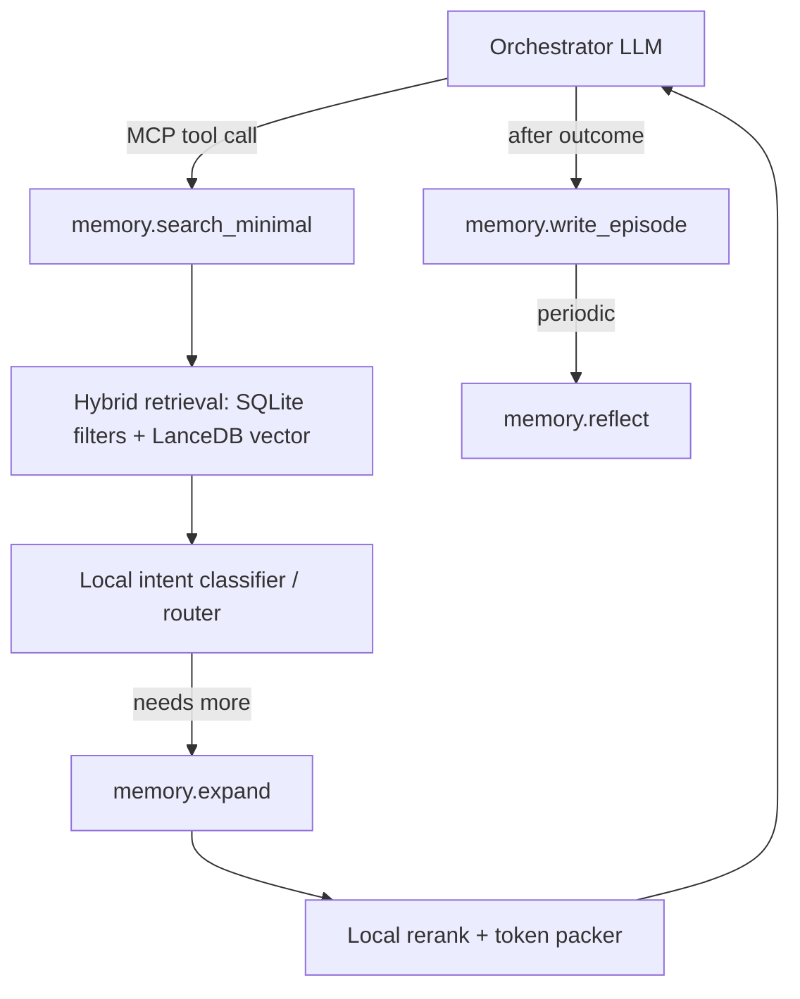

# Architecting a Local-First, Agentic Knowledge Base in Rust

## Executive Summary

This report proposes a local-first "Personal Second Brain" architecture in which Markdown files are the immutable source of truth and all derived artefacts (embeddings, full-text indexes, task graphs, summaries) are rebuilt or incrementally updated on-device. The core pattern is **unidirectional sync**: a file watcher observes changes; content hashing suppresses redundant work; and a deterministic pipeline "upserts" chunk rows into a **LanceDB** table for semantic retrieval and into **SQLite** for metadata, backlinks, tasks, and token-optimised memory tiers. The design targets **zero network calls**, **zero ongoing cost**, and **low-latency tool calls** for an AI agent.

Two evidence-backed conclusions shape the agentic memory layer:

1. Long-running agent performance is dominated by **context window scarcity**, so memory systems must treat token budgeting as a first-class constraint rather than "retrieve top-k chunks". This is a central motivation in systems like **MemGPT** (virtual context management inspired by hierarchical memory tiers) and **Mem0** (explicit extraction/consolidation/retrieval to reduce token cost and latency).
2. Retrieval quality and cost improve when you explicitly model **memory types and tiers**, and separate: (a) raw episodic traces, (b) structured metadata/links, and (c) multi-level summaries/reflections. This aligns with cognitive distinctions (episodic vs semantic) and with agent architectures such as **Generative Agents**, which combine recency, relevance, and importance and inject only top-ranked memories that fit the context window, plus periodic reflective synthesis.

Implementation-wise, the recommended embedding baseline is **BAAI/bge-small-en-v1.5**, a BERT-family model with **384-dimensional** outputs and **512** max position embeddings. For pooling, BGE documentation demonstrates **CLS pooling (first token)** followed by **L2 normalisation**; this pairs naturally with LanceDB's recommendation to use **dot product** for normalised vectors for best performance. The report includes a concise Rust boilerplate for `File Watcher -> Candle embedder -> LanceDB merge_insert upsert`, and a token-optimised MCP tool surface (`memory.search_minimal / expand / reflect / write_episode`) designed to keep agent context tight and to progressively disclose more detail only when required.

---

## System Goals and Assumptions

### Non-Negotiable Goals

- **Local-only execution**: every external dependency (models, tokenisers) is stored locally and loaded from disk
- **Markdown as the source of truth**: "sync" always means "derive indexes from Markdown", never "write back to Markdown"
- **Zero ongoing cost**: no API calls, no subscriptions, no cloud dependencies
- **High performance**: low-latency tool calls, predictable token footprints
- **Agent-first ergonomics**: explicit control loops for consolidation and pruning

### Assumptions

- The vault is a normal filesystem directory
- Hardware may be CPU-only or CPU+GPU
- Model weights (`model.safetensors` and `tokenizer.json`) are available locally
- The agent runtime communicates through MCP stdio JSON-RPC
- These assumptions match Candle's emphasis on local inference using safetensors weights and multiple backends (optimised CPU, optional CUDA) and MCP's explicit stdio transport

### Operational Architecture

- **SQLite** = "control plane" (metadata, tasks, graph edges, hashing state, token budgets)
- **LanceDB** = "data plane" (embedding-heavy retrieval with Arrow-native vector columns)
- This separation is strategic: SQLite excels at transactional joins and deterministic bookkeeping while LanceDB is built for vector similarity search with database-like indexing/optimisation cycles

---

## Data Model and Storage Roles

### Markdown Documents (Source of Truth)

Each file has a stable identity derived from path + inode (where available) or a generated UUID persisted in SQLite (to survive renames). Because file editors often implement save as "write temp + rename" and notify events are editor-dependent, document identity is treated as separate from raw filesystem events (paths are mutable).

### SQLite (Metadata and Graph Index)

SQLite maintains fast, transactional indexes that do not require large-vector scans:

| Table | Key Columns | Purpose |
|-------|------------|---------|
| `files` | `file_id`, `path`, `content_hash`, `mtime`, `size`, `last_indexed_at`, `deleted_at` | File identity and hash gate |
| `chunks` | `chunk_id`, `file_id`, `chunk_ord`, `byte_start`, `byte_end`, `token_estimate`, `chunk_hash` | Chunk metadata |
| `links` / `backlinks` | adjacency list | Wiki-links/Markdown links |
| `tasks` | status, due dates, backreferences | Parsed `- [ ]`/`- [x]` items |
| `summaries` | multi-tier summaries/reflections | Agentic memory tiers |
| `fts_chunks` (FTS5) | content, title, tags | External-content full-text index |

**Configuration requirements:**
- **WAL mode**: improves concurrent read/write behaviour (readers don't block writers)
- **FTS5 external-content tables**: avoid duplicating chunk text; maintained via triggers
- Trigger patterns keep FTS index consistent with the unidirectional sync pipeline

### Optional: sqlite-vec

`sqlite-vec` provides `vec0` virtual tables for vector storage and KNN-style search. Useful for:
- Per-note embeddings or small caches
- Single-file artefact portability
- Fallback when a lightweight all-in-one solution is preferred

### LanceDB (Semantic Memory Rows)

LanceDB stores chunk-level rows with:

| Column | Type | Purpose |
|--------|------|---------|
| `chunk_id` | `Utf8` | Primary join key for merge_insert |
| `file_id` | `Utf8` | File provenance |
| `chunk_ord` | `Int32` | Ordering within file |
| `content` | `Utf8` | Chunk text payload |
| `embedding` | `FixedSizeList(Float32, 384)` | BGE-small vector |
| `tags` | `List(Utf8)` | Normalised tags |
| `created_at` | `Timestamp` | Creation time |
| `updated_at` | `Timestamp` | Last update (recency scoring) |
| `recency_score` | `Float32` | Pre-computed decay |
| `importance_score` | `Float32` | Importance weight |
| `kind` | `Utf8` | Memory type discriminator |

---

## Unidirectional Sync and Indexing Pipeline

### Pipeline Overview

```
files -> hashes -> parse -> chunk -> embed -> upsert -> optimise
```



### Filesystem Event Hygiene

- `notify` documents that editors differ: some truncate/write-in-place; others replace the file
- `notify-debouncer-full` provides higher-level event coalescing (rename stitching, deduped create/remove patterns)
- Debounced watchers recommended when in-order events are not required

### Upsert Correctness with Hashing

Hash the normalised Markdown content and store `content_hash` in SQLite. Only if the hash changed:

1. Update SQLite (`files`, `chunks`, `tasks`, `links`, and FTS triggers)
2. Re-embed changed chunks
3. `merge_insert` changed chunk rows into LanceDB

This prevents "index storms" from file-save patterns and makes the system robust to repeated events.

### LanceDB merge_insert Semantics

LanceDB distinguishes "matched", "not matched", and "not matched by source" rows:

- `when_matched_update_all` + `when_not_matched_insert_all` = canonical upsert
- `when_not_matched_by_source_delete(filter)` = constrained deletion (e.g., delete only old chunks for the current `file_id`, not for the entire table)
- Optional: `when_matched_update_all(Some("target.chunk_hash != source.chunk_hash"))` to skip updates when content is identical

### Index Maintenance

- Explicitly manage incremental reindexing via `optimize()` (compaction, pruning/cleanup, index update)
- Without reindexing, queries may fall back to brute force on unindexed rows
- Schedule based on time or "N writes / N rows" heuristics

---

## Local Embedding and LanceDB Indexing Internals

### BGE-small v1.5 Configuration

- **Hidden size**: 384
- **Max position embeddings**: 512
- Computationally attractive for on-device embeddings with predictable memory and vector size

### Pooling Options and Trade-offs

| Pooling | Computation | Quality | Compatibility | Speed | Recommendation |
|---------|------------|---------|---------------|-------|----------------|
| **CLS pooling** | `last_hidden_state[:, 0]` | Recommended in BGE usage | High: do not mix with mean | Fastest | **Default for BGE-small** |
| Mean pooling (mask-aware) | Sum token vectors * attention mask / mask sum | Matches sentence_transformers | Must be consistent | Slightly slower | Good fallback for SBERT-style models |
| Mean pooling (include padding) | Average over all positions | Generally undesirable | High risk | Similar to mean | Avoid |
| Max pooling | Per-dimension max | Can over-emphasise rare tokens | Medium | More than CLS | Only if validated |

### Distance Metric

- **L2 normalise BGE embeddings** + **dot product** distance = optimal pairing
- LanceDB recommends `dot` for normalised embeddings ("best performance")
- Cosine is the typical choice for unnormalised vectors

### Arrow Schema Design

LanceDB uses Arrow types; `FixedSizeList<Float32>` columns are treated as vector columns. Scalar indexing on filter columns improves filtering performance.

---

## Agentic Memory, Retrieval Policies, and Token Optimisation

### Memory Types and Tiers

| Tier | Type | Description | Token Cost |
|------|------|-------------|------------|
| 1 | **Episodic** | Specific events/observations (what happened, when) | High |
| 2 | **Semantic** | Distilled facts, stable concepts, durable knowledge | Medium |
| 3 | **Procedural** | "How-to" workflows, scripts, runbooks | Medium |

Agent systems that work over long horizons implement tiers that mirror these types:

1. **Raw chunks** (high recall, high token cost): parsed Markdown chunks + embeddings
2. **Structured metadata** (low token cost, high precision): tags, backlinks, tasks, timestamps, importance, entity mentions
3. **Multi-size summaries / reflections** (very low token cost): per-note, per-topic, per-episode summaries and reflection nodes

**Key research backing:**
- **MemGPT**: hierarchical tiers for virtual context management beyond limited context windows
- **Generative Agents**: complete memory stream with subset retrieval + periodic reflections
- **H-MEM**: multi-level memory by semantic abstraction for efficient retrieval

### Retrieval Policy: Progressive, Budget-First

1. **Classify intent** (cheap): task? note? entity? how-to? Route via small local classifier
2. **Search minimal** (very cheap): return stubs (IDs + 1-2 sentence summaries + scores)
3. **Expand selectively**: expand handful of stubs into raw chunks within strict budget
4. **Rerank locally**: local reranker/classifier to keep final context small
5. **Reflect/write episode**: store episode event + optional consolidated summary

### Hybrid Scoring Formula

```
S = w_v * sim_v + w_k * bm25 + w_r * f(dt) + w_l * g(links) + w_t * tag_match + w_i * importance
```

Inspired by **Generative Agents** (recency + importance + relevance):

| Component | Implementation |
|-----------|---------------|
| `sim_v` | LanceDB dot similarity |
| `bm25` | SQLite FTS5 ranking |
| `f(dt)` | `exp(-dt/tau)` with tau tuned per memory type |
| `g(links)` | `log(1 + backlinks)` from SQLite graph tables |
| `tag_match` | Exact/partial tag intersection |
| `importance` | Computed at write time, decays over time |

### Token Budget Allocation

```
T_avail = T_limit - (T_sys + T_hist + T_tool + T_safe)

T_mem = min(T_mem_cap, alpha * T_avail)
T_plan = beta * T_avail
T_evidence = (1 - alpha - beta) * T_avail
```



### Consolidation and Pruning Strategies

- **Episode write**: structured record of (goal, actions, tool results, outcome) as episodic memory
- **Reflection pass**: periodically generate higher-level abstractions from recent episodes (threshold: cumulative importance)
- **Decay/prune**: TTL or downsampling on low-importance, low-link, old raw chunks; keep semantic summaries
- **Belief updating**: `valid_from/valid_to` or `supersedes` edges in SQLite for temporal/state modelling

### Orchestrator-Specialist Loop



Local specialists:
- **Embedder**: Candle BERT (BGE) model kept hot in RAM; batch requests
- **Intent classifier**: small linear head on embeddings or compact ONNX classifier
- **Reranker**: dot-sim re-scoring or lightweight ONNX ranker (optional)
- **Consolidator**: generates summaries/reflections; outputs stored as memory tiers

---

## MCP Tool Surface

MCP specifies JSON-RPC messaging (UTF-8) over stdio transport. The tool surface uses progressive disclosure.

### `memory.search_minimal`

Return compact stubs; never return full chunk text by default.

**Request:**
```json
{
  "query": "What did I decide about batching embeddings and indexing cadence?",
  "filters": {
    "tags_any": ["rust", "indexing"],
    "kind_any": ["note", "decision", "episode"],
    "updated_after": "2026-01-01T00:00:00Z"
  },
  "budget_tokens": 600,
  "k": 12,
  "mode": "minimal"
}
```

**Response:**
```json
{
  "budget_tokens": 600,
  "used_tokens_est": 410,
  "results": [
    {
      "memory_id": "ep_01J...XYZ",
      "kind": "episode",
      "title": "Index optimisation cadence decision",
      "summary_2sent": "Decided to batch embeddings per debounce window and run LanceDB optimize on a schedule rather than per write. Chose dot similarity with normalised embeddings for speed.",
      "scores": {
        "hybrid": 0.82,
        "vector": 0.76,
        "keyword": 0.64,
        "recency": 0.71,
        "links": 0.40
      },
      "expand_hint": {
        "tool": "memory.expand",
        "args": {"memory_ids": ["ep_01J...XYZ"], "budget_tokens": 1200}
      }
    }
  ]
}
```

### `memory.expand`

Expand selected stubs into raw chunks with strict budgets and "quotable spans" with byte offsets for Markdown provenance.

### `memory.reflect`

Consolidate selected episodes/chunks into higher-tier summaries (semantic memory) stored in SQLite as durable, low-token memory objects.

### `memory.write_episode`

Write structured episodic events (goal, actions, tool outputs, outcome) and compute quick metadata (tags, importance).

### Response Conventions

- Every response includes `used_tokens_est` and `remaining_tokens_est`
- Include provenance pointers (`file_id`, `path`, `byte_start/end`)
- Include `mode` and `retrieval_steps` for observability
- Default to stubs + provenance; raw text only on explicit expansion within budget

---

## Implementation Strategy

### Architecture Summary

Run a long-lived Rust daemon that:
1. Keeps Candle models loaded (embedder + classifier + optional reranker)
2. Keeps SQLite connection pool open in WAL mode
3. Keeps LanceDB connection/table handles open with prewarmed indexes

### Operational Guidance

- **Keep models hot**: load weights once at startup; reuse tokenizer and model objects
- **Batch embeddings**: batch within debounce window (250-500ms); cap batch sizes for RAM
- **Index optimisation cadence**: schedule LanceDB `optimize()` periodically
- **Persist hashes in SQLite**: the hash gate is the correctness anchor
- **SQLite WAL mode**: concurrent reads (agent queries) with writes (indexing)
- **MCP stdio integration**: implement `tools/list` and `tools/call` handlers over stdio JSON-RPC

### Benchmarks to Prioritise

| Category | Metric | Description |
|----------|--------|-------------|
| Index freshness | `p50/p95 time_to_index` | File save -> SQLite updated -> LanceDB row visible |
| Index freshness | Staleness rate | Fraction of queries returning outdated results |
| Retrieval latency | `p50/p95 search_minimal_latency` | SQLite filters + LanceDB kNN + stub packing |
| Retrieval latency | `p50/p95 expand_latency` | Raw chunk fetch + rerank |
| Token metrics | `tokens_returned` per tool | Per search_minimal and expand |
| Token metrics | Tokens per successful answer | `tokens_injected / answer_quality` |
| Memory footprint | RSS with models loaded | Daemon steady-state |
| Memory footprint | Peak during embedding batch | Watch for spikes; batch sizing matters |

---

## Key Dependencies (Rust Crate Selection)

| Crate | Version | Purpose |
|-------|---------|---------|
| `tokio` | 1.36+ | Async runtime (multi-thread, fs, sync, time) |
| `notify-debouncer-full` | 0.7+ | Filesystem event coalescing |
| `blake3` | 1.x | Content hashing |
| `rusqlite` | 0.32+ (bundled) | SQLite with WAL mode, FTS5 |
| `candle-core/nn/transformers` | 0.9+ | Local BERT inference |
| `tokenizers` | 0.22+ | HuggingFace tokenizer |
| `lancedb` | 0.26+ | Vector database |
| `arrow-schema/arrow-array` | 57+ | Arrow types for LanceDB |
| `uuid` | 1.x (v7) | Ordered UUIDs for file identity |
| `serde/serde_json` | 1.x | Serialisation |
| `tracing/tracing-subscriber` | 0.1/0.3 | Structured logging |
| `anyhow` | 1.x | Error handling |

---

## Performance Analysis and Optimisation Strategy

### Core Principle

**Indexing is the expensive part; querying is cheap once warm.** All performance decisions flow from this asymmetry. The design does expensive work incrementally and sparingly, keeping the daemon responsive for interactive queries at all times.

### What Feels Fast vs Slow

| Operation | Typical Latency | Category |
|-----------|----------------|----------|
| SQLite FTS5 queries | 5–30ms | Interactive |
| LanceDB vector search (warm) | 10–50ms | Interactive |
| Hybrid fusion + scoring | 1–10ms | Interactive |
| Daemon with warm models | Instant (no load cost) | Interactive |
| Initial full vault indexing | Minutes (one-time) | Background |
| Embedding large chunk sets | CPU-heavy | Background |
| Cross-encoder reranking | 200ms–1s+ | Optional |
| ML summarization | Expensive | Deferred |

### The Three Biggest Laptop Killers

#### 1. Eager Summarization

If you summarize every chunk on ingestion, you burn CPU constantly. Even for small vaults this creates noticeable lag on file saves.

**Mitigation — Capsule generation strategy:**
- Always generate tiny **deterministic capsules** (rule-based) on ingest: title from heading hierarchy + first meaningful sentence + heading outline
- ML summarization only in **consolidation jobs** (idle, scheduled, or on-demand)
- Deterministic capsules are ~0ms overhead; ML summaries are seconds-to-minutes

#### 2. Reranking Everything

Cross-encoders are compute-heavy. A cross-encoder on top-20 candidates with ONNX Runtime on CPU is realistically 200–500ms.

**Mitigation:**
- Make rerank **opt-in per query** OR triggered only when fusion confidence is low
- Rerank only **top 10–30 fused candidates**, never the full pool
- Rerank **capsules/snippets**, not full chunks
- Load reranker **lazily** (not at daemon startup)

#### 3. Watcher Storms / Too Many Writes

The OS file watcher can emit hundreds of events during git pulls, branch switches, or mass edits.

**Mitigation:**
- **Debounce/coalesce** (250ms window, required first line of defense)
- **Bounded work queue** with "last write wins per file" coalescing
- **Batch SQLite writes** via single writer lane
- **Batch LanceDB upserts** to amortize merge_insert overhead
- Queue overflow policy: drop oldest entries (caught on next periodic scan)

### Memory Footprint

#### Storage

| Component | Size (100k chunks, 384-dim) | Notes |
|-----------|---------------------------|-------|
| LanceDB embeddings (raw) | ~147MB | N × dim × 4 bytes (float32) |
| LanceDB with indexes/overhead | ~200–400MB | Indexes, metadata, compaction fragments |
| SQLite (metadata + FTS) | ~50–150MB | Depends on content volume |
| **Total on-disk** | **~400–800MB** | Comfortable for modern laptop |

#### RAM

The biggest RAM consumer is models, not data:

| Component | RAM | Loading strategy |
|-----------|-----|-----------------|
| BGE-small embedder | ~130MB | **Always hot** (needed for ingest + query) |
| Cross-encoder reranker | Variable | **Lazy** (load on first use, idle-unload) |
| Summarizer model | Variable (can be large) | **Lazy** (consolidation only) |
| SQLite connection pool | ~10–30MB | Always open |
| LanceDB table handles | ~20–50MB | Always open |
| **Daemon baseline RSS** | **~300–400MB** | Without optional models |

**Key rule:** Keep embeddings always hot. Load reranker/summarizer lazily. Allow quantized weights (int8/fp16) where possible.

### LanceDB Compaction Strategy

Without periodic `optimize()`, queries fall back to brute-force scan on unindexed fragments. This is the primary source of query latency degradation over time.

**Dual-trigger strategy:**
- Compact after **~100–500 upserts** since last optimize, OR
- Compact after **5–10 minutes** elapsed since last optimize
- Whichever fires first triggers compaction
- Run on a background tokio task to avoid blocking indexer or query paths

### Practical Performance Expectations

For a "medium" vault (2k–10k Markdown files, 20k–200k chunks):

**Initial indexing:**
- ~5–15ms per embedding on CPU (BGE-small, no acceleration)
- 100k chunks × ~10ms = ~1000s ≈ **~17 minutes**
- With batching (batch size 32): ~10–15 minutes
- Metal acceleration could halve this, but Candle's Metal support for BERT-class is still maturing
- One-time or rare operation (full rebuild)

**Incremental updates (day-to-day):**
- Editing a note typically touches 1–10 chunks
- HashGate ensures only changed chunks are re-embedded
- Near-instant: sub-second to a couple seconds worst case (with debounce)

**Query latency (daemon warm):**
- `search_minimal` end-to-end: **20–80ms** (FTS + vector + fusion + stub packing)
- `expand` (chunk fetch by ID): **5–20ms**
- Optional rerank (top 20): adds **200–500ms**
- The "always-on" UX goal is realistic if rerank and summarization are optional

### Performant Daemon Profile

The target operational profile:

```
Daemon (always running):
  ├── Embedder: BGE-small loaded, warm
  ├── SQLite: connection pool open, WAL mode
  ├── LanceDB: table handles open, indexes warm
  └── Models: reranker/summarizer NOT loaded (lazy)

Indexer (event-driven):
  ├── Runs quickly on small changes (1-10 chunks)
  ├── Batches writes (SQLite + LanceDB)
  ├── Does NOT do heavy ML on hot path
  └── Backpressure: bounded queue, last-write-wins

Consolidation (scheduled/idle):
  ├── ML summarization runs here
  ├── Heavier processing, respects CPU budget
  └── Yields to indexer if file events arrive

Query (on-demand):
  ├── Uses cheap retrieval first (FTS + vector)
  ├── Rerank only if requested or confidence low
  └── Returns capsules by default, expand on demand
```

---

## References and Prior Art

- **MemGPT**: Virtual context management with hierarchical memory tiers for long-running agents
- **Mem0**: Explicit extraction/consolidation/retrieval to reduce token cost and latency
- **Generative Agents**: Recency + relevance + importance scoring; periodic reflective synthesis
- **H-MEM**: Multi-level memory organised by semantic abstraction
- **RecallM**: Belief updating and temporal understanding in memory systems
- **ReAct**: Interleaving reasoning and tool actions for agent loops
- **BAAI/bge-small-en-v1.5**: Embedding baseline (384-dim, 512 max positions, CLS pooling)
- **Candle**: Rust ML framework for local inference with safetensors
- **LanceDB**: Arrow-native vector database with merge_insert upsert semantics
- **SQLite FTS5**: External-content full-text search indexes
