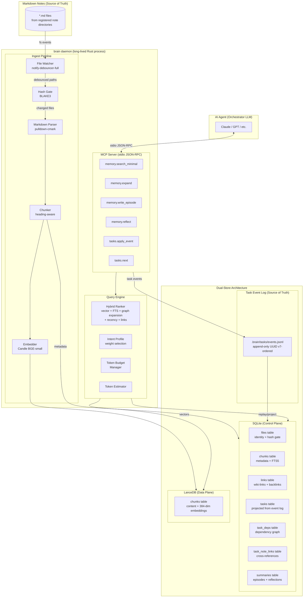
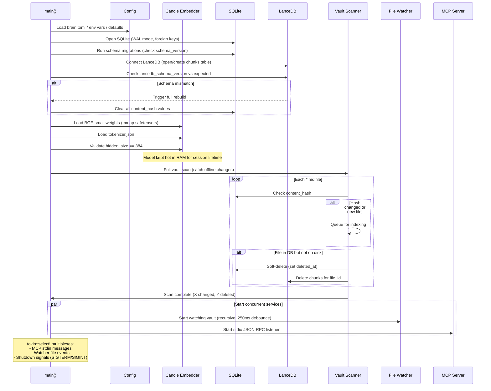
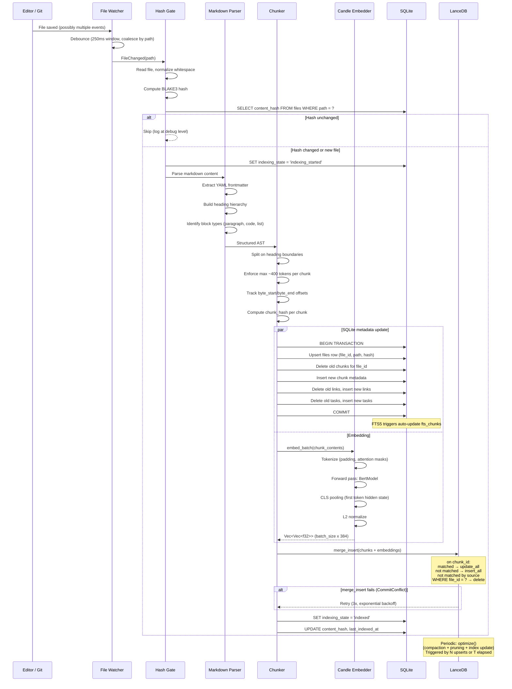
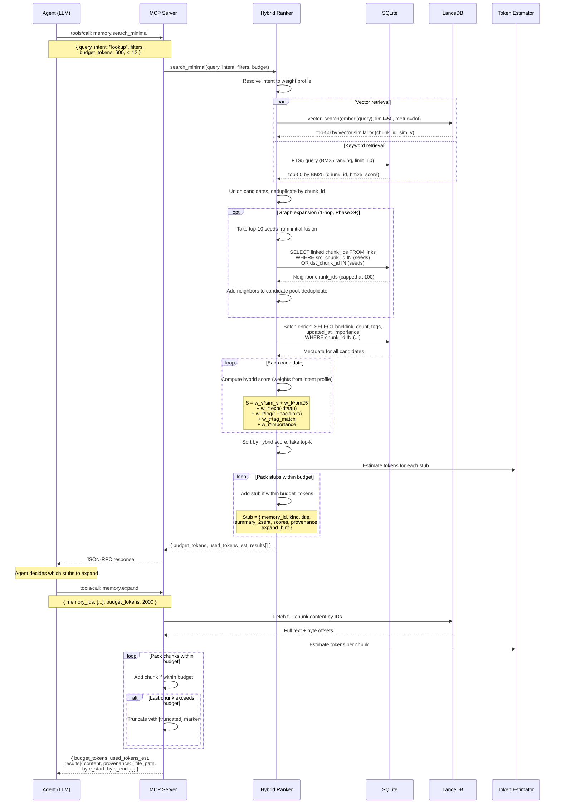
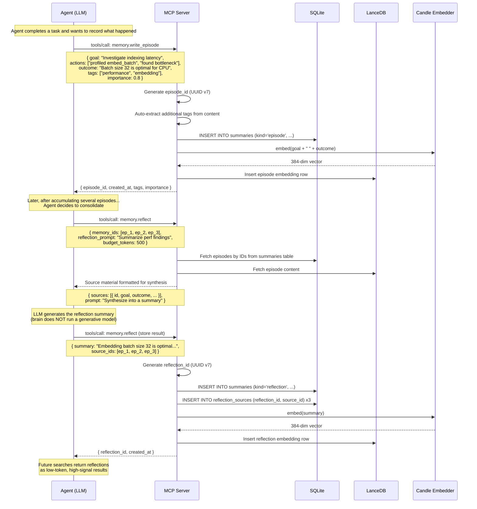
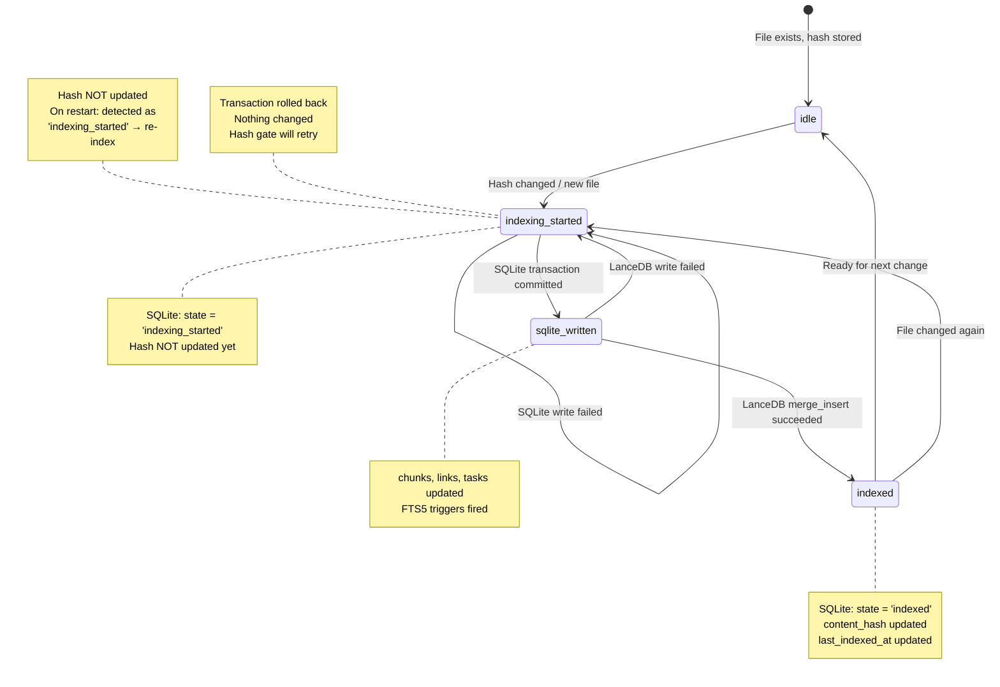
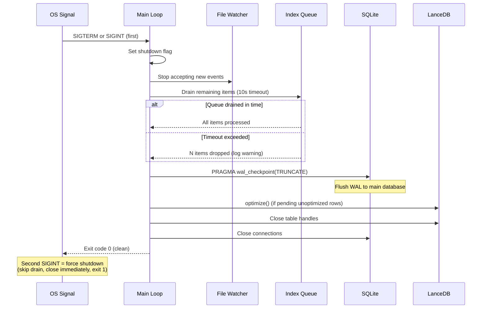
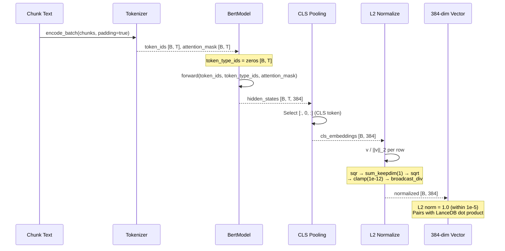

# Architecture Overview

A local-first "Personal Second Brain" that indexes Markdown notes into a dual-store system (SQLite + LanceDB) and exposes token-budgeted retrieval tools to AI agents over MCP stdio JSON-RPC.

## Concepts

A **brain** is a named knowledge container with its own notes, tasks, indexes, and configuration. Multiple brains can coexist (e.g., `personal`, `work-project`, `research`), managed by a central **registry** at `~/.brain/`.

**Core invariant**: Each domain has exactly one source of truth, and sync is always unidirectional:

- **Notes**: Markdown files are the source of truth. SQLite metadata, LanceDB embeddings, and FTS indexes are derived projections, rebuildable from source.
- **Tasks**: The append-only event log (`.brain/tasks/events.jsonl`, git-tracked) is the source of truth. SQLite task tables are derived projections, rebuildable by replaying the log.

Notes and tasks are parallel subsystems that can cross-reference each other (tasks link to note chunks, notes can mention task IDs) but have decoupled lifecycles and mutation patterns.

## Directory Structure

```
~/.brain/                                  # Central registry
  config.toml                              # Global config + registered brains
  brains/
    <brain-name>/                          # Per-brain derived data
      config.toml                          # Per-brain config (overrides global)
      brain.db                             # SQLite projections (notes + tasks)
      lancedb/                             # Vector indexes
~/code/my-project/                         # A project with brain notes
  .brain/
    brain.toml                             # Brain marker: name + note paths
    tasks/
      events.jsonl                         # Task event log (source of truth, git-tracked)
  docs/
    architecture.md                        # Indexed as notes
  notes/
    decisions.md                           # Indexed as notes
```

**Brain marker** (`.brain/brain.toml` in a project):
```toml
name = "my-project"
notes = ["docs", "notes"]                  # Relative paths to index
```

**Central registry** (`~/.brain/config.toml`):
```toml
[brains.my-project]
root = "~/code/my-project"
notes = ["~/code/my-project/docs", "~/code/my-project/notes"]

[brains.personal]
root = "~/notes"
notes = ["~/notes"]
```

**Key design decisions:**
- `brain init` in a project creates `.brain/brain.toml` and registers the brain centrally
- All derived data (SQLite, LanceDB) lives in `~/.brain/brains/<name>/`, not in the project
- The task event log lives in-repo at `.brain/tasks/events.jsonl` (git-tracked source of truth)
- A brain can index multiple note directories (e.g., `docs/` and `notes/` from one project)
- Moving a project just means updating the path in the registry
- No symlinks — just paths in config files

## System Architecture



## Storage Role Separation

| Concern | SQLite (Control Plane) | LanceDB (Data Plane) | Task Event Log |
|---------|----------------------|---------------------|----------------|
| **Role** | Transactional bookkeeping | Vector similarity search | Task source of truth |
| **Stores** | File identity, content hashes, chunk metadata, links, task projections, FTS5 index, summaries, schema versions | Chunk text, 384-dim embeddings, tags, timestamps, scores | Append-only task events (ULID-ordered JSONL) |
| **Access pattern** | Joins, filters, exact lookups, FTS5 BM25 | kNN vector search, batch upserts | Sequential append, full replay for rebuild |
| **Concurrency** | WAL mode (concurrent readers, single writer) | Arc\<Table\> shared across threads | Single writer (append-only) |
| **Consistency anchor** | content_hash gates note re-indexing | Derived from SQLite state | Log is authoritative; SQLite task tables are derived projections |

## Sequence Diagrams

### 1. Daemon Startup



### 2. Indexing Pipeline (File Change to Indexed)



### 3. Agent Retrieval Flow (search_minimal + expand)



### 4. Agent Memory Loop (Write + Reflect)



### 5. Dual-Store Consistency (Indexing State Machine)

Partial failures across SQLite and LanceDB are the hardest correctness problem. The indexing state machine ensures recovery.



### 6. Graceful Shutdown



### 7. Embedding Pipeline Detail



**Numerical stability**: The L2 normalization must clamp the magnitude to `max(||v||_2, 1e-12)` before dividing. Degenerate all-padding inputs can produce zero-magnitude vectors, and dividing by zero silently produces NaN that poisons the LanceDB index with no runtime error. Add a debug assertion that all output vectors satisfy `|1.0 - ||v||_2| < 1e-5`.

## Memory Architecture

```
                    Token Cost
                    High ──────────────────── Low
                    │                          │
    Tier 1          │  Raw Chunks              │
    (Episodic)      │  Full markdown text       │
                    │  384-dim embeddings       │
                    │                          │
    Tier 2          │         Structured Meta   │
    (Semantic)      │         Tags, backlinks   │
                    │         Tasks, timestamps  │
                    │                          │
    Tier 3          │              Summaries    │
    (Procedural)    │              Reflections  │
                    │              2-sent stubs │
                    │                          │
                    High ──────────────────── Low
                    Recall
```

The retrieval policy is **progressive and budget-first**:

1. **search_minimal** returns compact stubs (Tier 2/3 cost) — covers both notes and task capsules
2. **expand** fetches raw chunks on demand (Tier 1 cost)
3. **write_episode** stores structured events (creates Tier 1)
4. **reflect** consolidates into summaries (creates Tier 3 from Tier 1)
5. **tasks.apply_event** creates/mutates tasks via event log (task subsystem)
6. **tasks.next** returns highest-priority ready task (deterministic selection)

## Hybrid Scoring

All retrieval combines six signals into a single relevance score:

```
S = w_v * sim_v + w_k * bm25 + w_r * f(dt) + w_l * g(links) + w_t * tag_match + w_i * importance
```

| Signal | Source | Computation |
|--------|--------|-------------|
| `sim_v` | LanceDB | Dot product similarity (normalized vectors) |
| `bm25` | SQLite FTS5 | BM25 rank, normalized to [0,1] |
| `f(dt)` | SQLite | `exp(-dt/tau)`, tau=30 days default |
| `g(links)` | SQLite | `log(1 + backlinks) / log(1 + max_backlinks)` |
| `tag_match` | SQLite | Jaccard coefficient (query tags vs chunk tags) |
| `importance` | SQLite/LanceDB | Pre-computed at write time |

### Intent-Driven Weight Profiles

The `intent` parameter on `memory.search_minimal` selects a weight profile that adjusts signal priorities:

| Intent | Description | Upweighted signals | Downweighted signals |
|--------|-------------|-------------------|---------------------|
| `lookup` | Fact finding, direct answers | `bm25`, `tag_match` | `importance` |
| `planning` | What to do next | `f(dt)`, `g(links)`, `importance` | `bm25` |
| `reflection` | What happened, how we decided | `f(dt)`, `importance` | `tag_match` |
| `synthesis` | Write or design something | `sim_v`, `g(links)` | `f(dt)` |
| `auto` | Default, no adjustment | Equal weights (1/6 each) | — |

Weight profiles are stored as a lookup table and are configurable via `brain.toml`.

**Invariant**: All weight profiles MUST sum to 1.0. Validate at load time; normalize by dividing each weight by the sum if needed. Hand-tuned profiles can silently drift, biasing retrieval without runtime errors.

**Edge cases in signal computation**:
- `bm25` normalization: divide by `max(max_bm25_in_result_set, 1e-12)` — zero FTS matches means all BM25 scores should be 0.0, not NaN.
- `tag_match` (Jaccard coefficient): `J(∅, ∅) = 0.0` by convention, not division-by-zero.
- `g(links)`: `log(1 + 0) / log(1 + max_L)` is well-defined (= 0.0), but guard `max_L = 0` with a denominator of 1.0.

### Candidate Sources

Retrieval draws candidates from three sources, fused before scoring:

| Source | Store | Phase | Description |
|--------|-------|-------|-------------|
| Vector search | LanceDB | Phase 2 | Top-50 by dot product similarity |
| Keyword search | SQLite FTS5 | Phase 2 | Top-50 by BM25 |
| Graph expansion | SQLite links | Phase 3+ | 1-hop neighbors of top-10 seeds (capped at 100) |

Graph expansion captures transitively relevant content in interlinked vaults: a query matching note A will also surface note B if A links to B, even when B has low direct similarity. Candidates from all sources are unioned, deduplicated, then scored through the hybrid formula.

## Key Technology Choices

| Component | Choice | Rationale |
|-----------|--------|-----------|
| Language | Rust | Performance, safety, single-binary deployment |
| Async runtime | tokio | Required by LanceDB async API |
| Embedding model | BGE-small-en-v1.5 (384-dim) | Small, fast, well-benchmarked for CPU |
| ML framework | Candle | Rust-native, safetensors mmap, no Python dependency |
| Vector store | LanceDB | Arrow-native, merge_insert upsert, disk-based |
| Metadata store | SQLite (WAL mode) | Transactional, FTS5, concurrent reads |
| Content hashing | BLAKE3 | 3-4x faster than SHA-256 |
| File watching | notify-debouncer-full | Editor-agnostic event coalescing |
| File identity | UUID v7 | Time-ordered, survives renames |
| Agent protocol | MCP stdio JSON-RPC | Standard for AI tool integration |
| Distance metric | Dot product | Optimal for L2-normalized embeddings |
| Pooling | CLS (first token) | BGE-recommended, fastest |
| Reranker (post-v1) | ONNX Runtime via `ort` crate | Cross-encoder reranking on top-N fused candidates |

## Performance Design

The system is designed around one core insight: **indexing is the expensive part; querying is cheap once warm**. All performance decisions flow from keeping the daemon responsive during normal use while deferring heavy computation to idle or scheduled windows.

### Design Decisions

#### 1. Capsule Generation Strategy

Every chunk gets a **deterministic capsule** at ingest time — zero ML cost:

| Capsule field | Source | Cost |
|---------------|--------|------|
| `title` | Heading hierarchy from Markdown AST | Negligible |
| `summary_2sent` | First meaningful sentence + heading outline | Negligible |
| `tags` | Frontmatter + auto-extracted | Negligible |

ML-quality summarization runs only during **consolidation** (idle/scheduled), never on the hot ingest path. This prevents the biggest laptop killer: eager summarization burning CPU on every file save.

#### 2. Reranker Policy

Cross-encoder reranking is **opt-in**, not default:

- Triggered per-query when the caller requests it, OR when fusion confidence is below threshold
- Applied to the **top 10–30 fused candidates** only, never the full candidate pool
- Operates on **capsules/snippets**, not full chunks, to minimize compute
- Latency budget: 200–500ms on CPU for top-20 candidates
- The reranker model is **loaded lazily** (not at startup) and unloaded after idle timeout

#### 3. Work Queue and Backpressure

The indexing pipeline is protected against watcher storms (git pulls, branch switches, mass edits):

```
File events → Debounce (250ms) → Bounded work queue → Indexer
                                      ↓
                              Overflow policy:
                              • Last-write-wins per file_id
                              • Drop oldest if queue full
                              • Batch SQLite writes (single writer lane)
                              • Batch LanceDB upserts
```

Key invariant: the queue is bounded. If it fills up, dropped files are caught on the next periodic scan.

#### 4. LanceDB Compaction Strategy

Without compaction, queries fall back to brute-force scan on unindexed fragments. The `optimize()` schedule uses a **dual trigger**:

| Trigger | Threshold | Rationale |
|---------|-----------|-----------|
| Upsert count | ~100–500 upserts since last optimize | Keeps unindexed fragment count bounded |
| Elapsed time | 5–10 minutes since last optimize | Catches quiet periods after bursts |

Whichever fires first triggers compaction. Runs on a background task to avoid blocking indexer or query paths.

#### 5. Model Loading Strategy

| Model | Loading | Memory | Rationale |
|-------|---------|--------|-----------|
| BGE-small embedder | **Always hot** | ~130MB | Needed for every ingest and query |
| Cross-encoder reranker | **Lazy** (on first use) | Variable | Rarely needed; idle-unloaded |
| Summarizer | **Lazy** (consolidation only) | Variable | Only runs during idle/scheduled jobs |

Target daemon baseline RSS: **300–400MB** (embedder + SQLite + LanceDB structures).

### Performance Expectations

Assumes a "medium" vault: 2k–10k Markdown files, 20k–200k chunks, 384-dim embeddings.

| Operation | Expected Latency | Notes |
|-----------|-----------------|-------|
| SQLite FTS5 query | 5–30ms | Scales with vault size |
| LanceDB vector search | 10–50ms | After compaction; warm indexes |
| Hybrid fusion + scoring | 1–10ms | Lightweight arithmetic |
| `search_minimal` end-to-end | 20–80ms | FTS + vector + fusion + stub packing |
| `expand` (fetch chunks) | 5–20ms | Direct ID lookup |
| Optional rerank (top 20) | 200–500ms | Cross-encoder on CPU |
| Incremental index (1 file) | Sub-second | Hash gate + embed 1–10 chunks |
| Initial full index (100k chunks) | ~10–17 min | CPU, batch size 32, no acceleration |

### Storage Footprint

| Component | Size (100k chunks) | Notes |
|-----------|-------------------|-------|
| Embeddings (raw float32) | ~147MB | 100k × 384 × 4 bytes |
| LanceDB with indexes | ~200–400MB | Overhead from indexes + metadata |
| SQLite (metadata + FTS) | ~50–150MB | Depends on content length |
| BGE-small model weights | ~130MB | Loaded in RAM via mmap |
| **Total disk** | **~400MB–800MB** | Comfortable for laptop |
| **Daemon RSS (baseline)** | **~300–400MB** | Embedder + stores, no optional models |

## Mathematical Foundations

The system relies on concepts from several mathematical and computer science domains. This section summarizes the key foundations; see RESEARCH.md § Mathematical Foundations for detailed formulas, numerical verification, and implementation guidance.

### Linear Algebra & Embeddings

Every chunk is a point in R^384. The embedding pipeline transforms text through a BERT forward pass (`[B, T] → [B, T, 384]`), CLS pooling (`[:, 0, :]`), and L2 normalization onto the unit hypersphere S^383. Dot product on unit vectors equals cosine similarity — this is why LanceDB uses `dot` metric after normalization, saving ~2x compute vs explicit cosine.

### Information Retrieval & Scoring

The hybrid scoring formula is a weighted linear combination of 6 orthogonal signals. BM25 (from SQLite FTS5) provides term-frequency scoring with document-length normalization. Min-max normalization maps BM25 to [0,1]. The Jaccard coefficient measures tag overlap as `|A∩B| / |A∪B|`. All signals are combined with intent-driven weight profiles that must sum to 1.0.

### Exponential Decay & Recency

The recency signal uses exponential decay: `f(dt) = exp(-dt/τ)` with τ=30 days (configurable). The half-life is `τ × ln(2) ≈ 20.8 days`. The backlink signal uses logarithmic scaling: `g(L) = log(1+L) / log(1+max_L)`, which compresses the dynamic range of link counts.

### Graph Theory

The links table is a directed graph (adjacency list). Graph expansion performs 1-hop BFS from seed nodes. The task dependency graph is a DAG — cycle detection (DFS-based, O(V+E)) is required when adding edges. In-degree counting provides the backlink score; future work may upgrade to iterative PageRank for importance propagation.

### Probability & Hashing

BLAKE3 (256-bit) provides collision probability `< 10^(-70)` for 10k files. UUID v7 provides time-ordered identity with a birthday-problem safe threshold of ~2^64 IDs. ULID provides monotonic event ordering with same-millisecond disambiguation via incrementing counter. IVF-PQ indexing (Product Quantization in Voronoi cells) enables sub-5ms ANN search at 100x vector compression with >95% recall.

### Concurrency & Async

The daemon uses tokio for async concurrency: file watcher events, MCP request handling, and indexing run as concurrent tasks multiplexed via `tokio::select!`. SQLite WAL mode enables concurrent readers with a single writer. The bounded work queue with file_id coalescing provides backpressure against watcher storms.
