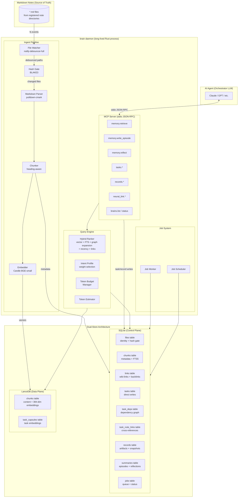
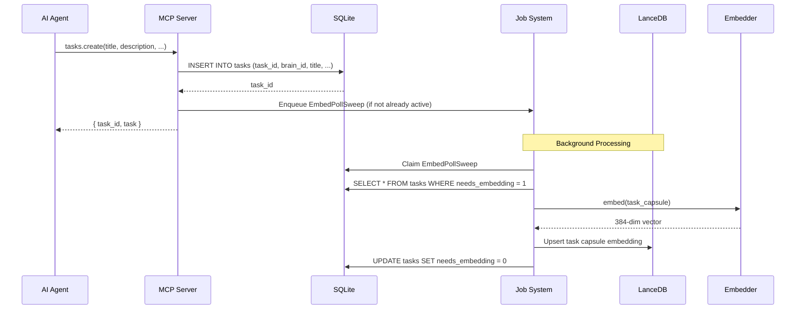
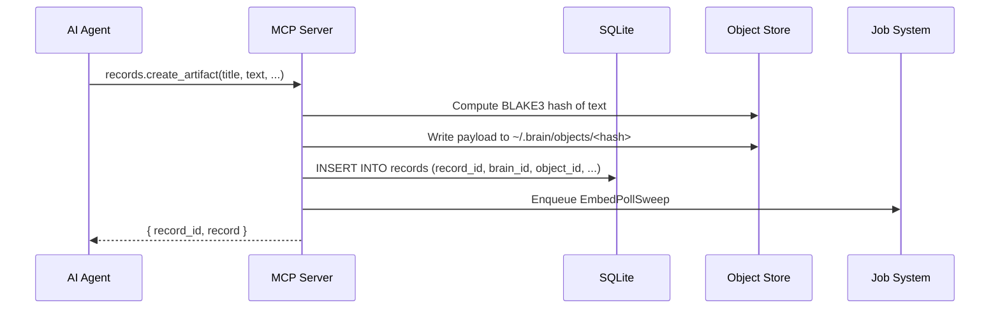
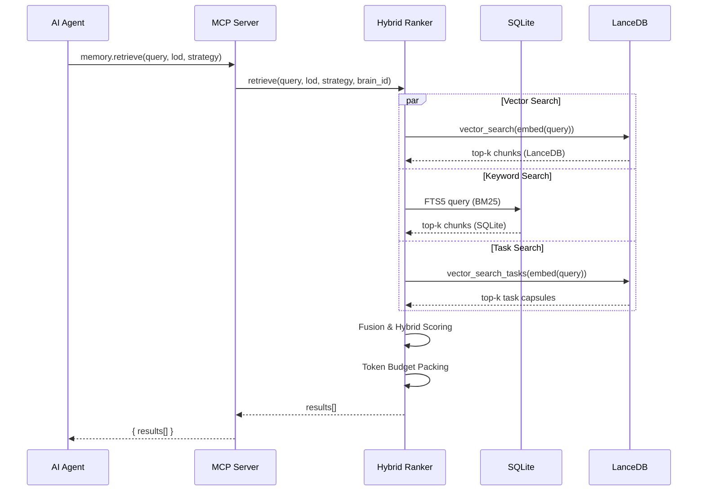

# Architecture Overview

A local-first personal knowledge base with task management and memory retrieval, exposing token-budgeted tools to AI agents over MCP.

## Concepts

A **brain** is a named knowledge container with its own notes, tasks, indexes, and configuration. Multiple brains can coexist (e.g., `personal`, `work-project`, `research`), managed by a central **registry** at `~/.brain/`.

### Core Domains

Brain manages three primary domains with decoupled lifecycles:

| Domain | Source of Truth | Derived State | Purpose |
|--------|---|---|---|
| **Notes** | Markdown files in repo | SQLite metadata + LanceDB embeddings | Semantic search, indexing |
| **Tasks** | SQLite (`brain.db`) | LanceDB capsules (searchable via `memory.retrieve`) | Intent, execution state, dependencies |
| **Records** | SQLite (`brain.db`) + object store (`~/.brain/objects/`) | — | Work products, artifacts, snapshots |

**Core invariant**: Each domain has exactly one source of truth, and sync is always unidirectional.

## Scoping Model

All domains are partitioned by `brain_id` in the unified SQLite database:

- **Files and chunks** carry `brain_id`, set during indexing from the owning brain's registered roots. FTS search defaults to the current brain for single-brain queries.
- **Tasks, records, summaries, and jobs** are partitioned by `brain_id` on write.
- **LanceDB** is inherently per-brain (separate directories per brain), so vector search is always scoped.

Search scoping is controlled by the `brains` parameter on MCP search tools:

| Mode | Behavior |
|------|----------|
| Omitted (default) | FTS scoped to current brain's `brain_id` |
| `brains: ["work", "personal"]` | Federated search across specified brains |
| `brains: ["all"]` | No brain_id filter (workspace-global) |

The v37 schema migration backfills `brain_id` on existing files/chunks by matching file paths against registered brain roots. Synthetic files (`task:*`, `task-outcome:*`, `record:*`) are backfilled by joining to their owning task/record.

## Repository Boundary

The codebase is split into two primary crates to separate domain logic from persistence implementations:

- **`brain_lib`**: Contains the core domain logic, traits (ports), and the MCP server implementation. It defines how indexing, retrieval, and task management should work without being tied to a specific database.
- **`brain_persistence`**: Contains the concrete SQL implementations (adapters) for SQLite and LanceDB. It handles schema migrations, query execution, and the content-addressed object store.

This boundary is enforced by clippy rules: `disallowed-types` and `disallowed-macros` in both `brain_lib/clippy.toml` and `cli/clippy.toml` prevent direct `rusqlite` imports outside `brain_persistence`. Infrastructure code (migrations, config) uses targeted `#[allow]` annotations.

## Directory Structure

```
~/.brain/                                  # Central registry
  state_projection.toml                     # Read-only projection of DB state
  brain.db                                 # Unified SQLite (all brains partitioned by brain_id)
  objects/                                 # Shared content-addressed object store (BLAKE3-keyed)
    <2-char prefix>/
      <full 64-char BLAKE3 hex>            # Payload bytes, immutable
  brains/
    <brain-name>/                          # Per-brain derived data
      config.toml                          # Per-brain config (overrides global)
      lancedb/                             # Per-brain vector index (semantic space is distinct)
~/code/my-project/                         # A project with brain notes
  .brain/
    brain.toml                             # Brain marker: name + note paths
  docs/
    architecture.md                        # Indexed as notes
  notes/
    decisions.md                           # Indexed as notes
```

## System Architecture



## Job System Architecture

Brain uses an internal job system for deferred and recurring work. Jobs are stored in the `jobs` table in SQLite and processed by a background worker.

- **Enqueue**: Jobs are added to the queue with a `kind`, `payload`, and `priority`.
- **Process**: The `JobWorker` claims ready jobs, dispatches them to specialized handlers, and updates their status (`pending`, `in_progress`, `done`, `failed`).
- **Retry**: Failed jobs are automatically rescheduled using an exponential backoff strategy until they succeed or exhaust their retry limit.
- **Recurring Jobs**: The `JobScheduler` ensures that singleton jobs (like `full_scan_sweep` or `embed_poll_sweep`) are reconciled and rescheduled after completion.

## Sequence Diagrams

### 1. Task Creation Flow



### 2. Record Storage Flow



### 3. Hybrid Query Flow



## Storage Role Separation

| Concern | SQLite (Sole Source of Truth) | LanceDB (Per-Brain Data Plane) | Object Store (Global) |
|---------|----------------------|---------------------|--------------|
| **Role** | Transactional state for all domains — all tables partitioned by `brain_id` | Per-brain vector similarity search | Global payload storage — deduplication across all brains |
| **Stores** | Files, chunks (with brain_id), links, tasks, records, summaries, jobs, FTS5 index | Per-brain chunk text, task capsules, 384-dim embeddings | Immutable content-addressed blobs (BLAKE3-keyed) |
| **Access pattern** | Joins, filters, exact lookups, FTS5 BM25 | Per-brain kNN vector search | Write-once keyed by hash, read by hash path |

## Performance Design

The system is designed around one core insight: **indexing is the expensive part; querying is cheap once warm**.

- **Capsule Generation**: Every chunk and task gets a deterministic capsule at ingest time (zero ML cost).
- **Work Queue**: The indexing pipeline is protected against watcher storms via a bounded work queue with coalescing.
- **Compaction**: LanceDB fragments are periodically optimized to maintain query performance.
- **Model Loading**: The BGE-small embedder is kept hot in RAM (~130MB), while larger models (summarizers) are loaded lazily.

## Mathematical Foundations

- **Embeddings**: Chunks and tasks are mapped to R^384 and L2-normalized onto the unit hypersphere.
- **Hybrid Scoring**: Combines vector similarity, BM25, recency decay, backlink count, tag match, and importance.
- **Recency**: Uses exponential decay `f(dt) = exp(-dt/τ)` with τ=30 days.
- **Hashing**: BLAKE3 for content identity and object store keys.
- **Identity**: UUID v7 for time-ordered, monotonic identifiers.
